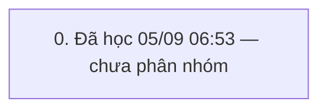

# QUY TRÌNH HĐ + tạo mới khách (`BAN_1`) — v6

> Trạng thái: **GĐ đã duyệt** · cập nhật 05/09/2026 06:57 · 1 pha · 29 bước (7 ghi) · KHBL làm 22 · cần kiểm 7 · bỏ 0

Nguồn học: HỌC từ khung 05/09/2026 06:50→23:59 (admin)

## 0. Đã học 05/09 06:53 — chưa phân nhóm

Bảng đổi trong khung: I_CUSTOMER, I_DIEMTICHLUY, I_GOLD_BAL, I_LICHSUTICHLUYDIEM, RetailLog, SYS_BILL_COUNTER, SYS_CODEMASTERS, TRN_DAILY_LOG, TRN_RT_BUYSELL, TRN_RT_BUYSELL_SELL, T_CUSTOMER_DEBT, T_PRODUCT, T_PRODUCT_TRACKING, T_TILL_BAL, T_TILL_TXN, T_TILL_TXN_DETAIL, TonKho, tbc_TinNhan

| # | Bước | Proc | Ghi/đọc | Tham số quan trọng | Bảng đổi | KHBL | Đối chiếu | Ghi chú |
|---|---|---|---|---|---|---|---|---|
| 0.1 | Sản phẩm/kho: T_PRODUCT_GetByCodeForSell | `T_PRODUCT_GetByCodeForSell` | đọc | exec T_PRODUCT_GetByCodeForSell @p_ProductCode=N'1D60001400',@p_TaskPrice=0,@p_ShopID='',@p_CheckRealSL=1,@p_TillID='TIL260500000001',@p_CustID='',@p_ShopID_XRate='',@p_RutGon='0' | — | KHBL thực hiện | Chưa đối chiếu | — |
| 0.2 | HĐ bán: TRN_RT_BUYSELL_Ins | `TRN_RT_BUYSELL_Ins` | ghi | declare @p25 xml set @p25=convert(xml,N'<NewDataSet><TRN_RT_BUYSELL_SELL><ProductID>PD2609000000811</ProductID><ProductCode>1D60001400</ProductCode><ProductDesc>Dây mì</ProductDesc><PriceCcy>VND</PriceCcy><PriceUnit>L</PriceUnit><CcyRate>1000.000</CcyRate><CcyRateTaskPrice>1000.000</CcyRateTaskPrice><TotalWeight>123.4000000000000000000</TotalWeight><GoldWeight>123.400000000000000000</GoldWeight><D | — | Cần kiểm trên sandbox | Chưa đối chiếu | — |
| 0.3 | HĐ bán: TRN_RT_BUYSELL_Get | `TRN_RT_BUYSELL_Get` | đọc | exec TRN_RT_BUYSELL_Get @p_TrnID='TRB260900000606',@p_ShopID_XRate='' | — | KHBL thực hiện | Chưa đối chiếu | — |
| 0.4 | Sản phẩm/kho: T_PRODUCT_GetByCodeForSell | `T_PRODUCT_GetByCodeForSell` | đọc | exec T_PRODUCT_GetByCodeForSell @p_ProductCode=N'1D60001399',@p_TaskPrice=0,@p_ShopID='',@p_CheckRealSL=1,@p_TillID='TIL260500000001',@p_CustID='',@p_ShopID_XRate='',@p_RutGon='0' | — | KHBL thực hiện | Chưa đối chiếu | — |
| 0.5 | HĐ bán: TRN_RT_BUYSELL_Upd | `TRN_RT_BUYSELL_Upd` | ghi | declare @p29 xml set @p29=convert(xml,N'<NewDataSet><TRN_RT_BUYSELL_SELL><STT>1</STT><ProductID>PD2609000000811</ProductID><ProductCode>1D60001400</ProductCode><ProductDesc>Dây mì</ProductDesc><GroupID>PG1411000000016</GroupID><PriceCcy>VND</PriceCcy><PriceUnit>L</PriceUnit><CcyRate>1000.000</CcyRate><CcyRateTaskPrice>1000.000</CcyRateTaskPrice><PCcyRate>1000.000</PCcyRate><TotalWeight>123.4000000 | — | Cần kiểm trên sandbox | Chưa đối chiếu | — |
| 0.6 | HĐ bán: TRN_RT_BUYSELL_Get | `TRN_RT_BUYSELL_Get` | đọc | exec TRN_RT_BUYSELL_Get @p_TrnID='TRB260900000606',@p_ShopID_XRate='' | — | KHBL thực hiện | Chưa đối chiếu | — |
| 0.7 | Hệ thống: SYS_LOADCOMBO ×2 | `SYS_LOADCOMBO` ×N | đọc | exec [SYS_LOADCOMBO] @pType=N'I_CUSTOMER_GROUP',@pParam=N'',@ShopID='' | — | KHBL thực hiện | Chưa đối chiếu | — |
| 0.8 | Khác: I_GIAODICH_Lst | `I_GIAODICH_Lst` | đọc | I_GIAODICH_Lst | — | KHBL thực hiện | Chưa đối chiếu | — |
| 0.9 | Khách hàng: I_CUSTOMER_Ins | `I_CUSTOMER_Ins` | ghi | declare @p18 xml set @p18=convert(xml,N'') exec [I_CUSTOMER_Ins] @p_CustID='',@p_CustCode=N'',@p_CustName=N'Anh Abc',@p_Address=N'',@p_Phone='0236598741',@p_Notes=N'',@p_Active='1',@p_CMND='',@p_CustGroupID='',@p_CustTypeID='',@p_BirthDate='05/09/2026',@p_Gender='0',@p_Email='',@p_DateOfJoining='',@p_LastTradingDate='',@TuDongNangHang='1',@p_Image=NULL,@MaGD=@p18,@p_Company=N'',@p_Company_Address= | — | Cần kiểm trên sandbox | Chưa đối chiếu | — |
| 0.10 | Khách hàng: I_DiemTichLuy_InsFromGT | `I_DiemTichLuy_InsFromGT` | đọc | exec [I_DiemTichLuy_InsFromGT] @p_CustID='CU2609000000192' | — | KHBL thực hiện | Chưa đối chiếu | — |
| 0.11 | Hệ thống: SYS_LOADCOMBO | `SYS_LOADCOMBO` | đọc | exec [SYS_LOADCOMBO] @pType=N'I_GOLD',@pParam=N'',@ShopID='' | — | KHBL thực hiện | Chưa đối chiếu | — |
| 0.12 | Khách hàng: I_CUSTOMER_Lst | `I_CUSTOMER_Lst` | đọc | exec I_CUSTOMER_Lst @p_CustID='',@p_CustCode=N'',@p_CustName=N'',@p_Address=N'',@p_Phone='',@p_Notes=N'',@p_Active='1',@p_Sort='',@p_CustGroupID='',@p_CustTypeID='',@p_BirthDate='',@p_Gender='',@p_Email='',@p_DateOfJoining='',@p_LastTradingDate='',@p_LoaiGD='SRT',@ShopID='' | — | KHBL thực hiện | Chưa đối chiếu | — |
| 0.13 | Hệ thống: SYS_LOADCOMBO ×2 | `SYS_LOADCOMBO` ×N | đọc | exec [SYS_LOADCOMBO] @pType=N'T_EMPLOYEE',@pParam=N'',@ShopID='' | — | KHBL thực hiện | Chưa đối chiếu | — |
| 0.14 | HĐ bán: TRN_RT_BUYSELL_Upd | `TRN_RT_BUYSELL_Upd` | ghi | declare @p29 xml set @p29=convert(xml,N'<NewDataSet><TRN_RT_BUYSELL_SELL><STT>1</STT><ProductID>PD2609000000811</ProductID><ProductCode>1D60001400</ProductCode><ProductDesc>Dây mì</ProductDesc><GroupID>PG1411000000016</GroupID><PriceCcy>VND</PriceCcy><PriceUnit>L</PriceUnit><CcyRate>1000.000</CcyRate><CcyRateTaskPrice>1000.000</CcyRateTaskPrice><PCcyRate>1000.000</PCcyRate><TotalWeight>123.4000000 | — | Cần kiểm trên sandbox | Chưa đối chiếu | — |
| 0.15 | HĐ bán: TRN_RT_BUYSELL_Get ×2 | `TRN_RT_BUYSELL_Get` ×N | đọc | exec TRN_RT_BUYSELL_Get @p_TrnID='TRB260900000606',@p_ShopID_XRate='' | — | KHBL thực hiện | Chưa đối chiếu | — |
| 0.16 | HĐ bán: TRN_RT_BUYSELL_Upd | `TRN_RT_BUYSELL_Upd` | ghi | declare @p29 xml set @p29=convert(xml,N'<NewDataSet><TRN_RT_BUYSELL_SELL><STT>1</STT><ProductID>PD2609000000811</ProductID><ProductCode>1D60001400</ProductCode><ProductDesc>Dây mì</ProductDesc><GroupID>PG1411000000016</GroupID><PriceCcy>VND</PriceCcy><PriceUnit>L</PriceUnit><CcyRate>1000.000</CcyRate><CcyRateTaskPrice>1000.000</CcyRateTaskPrice><PCcyRate>1000.000</PCcyRate><TotalWeight>123.4000000 | — | Cần kiểm trên sandbox | Chưa đối chiếu | — |
| 0.17 | HĐ bán: TRN_RT_BUYSELL_Get | `TRN_RT_BUYSELL_Get` | đọc | exec TRN_RT_BUYSELL_Get @p_TrnID='TRB260900000606',@p_ShopID_XRate='' | — | KHBL thực hiện | Chưa đối chiếu | — |
| 0.18 | HĐ bán: TRN_RT_BUYSELL_Complete | `TRN_RT_BUYSELL_Complete` | ghi | exec [TRN_RT_BUYSELL_Complete] @p_TrnID='TRB260900000606',@p_UserID='US1806000000001',@p_ThuHo='0' | — | Cần kiểm trên sandbox | Chưa đối chiếu | — |
| 0.19 | Sổ quỹ: T_TILL_TXN_DETAIL_GetByTrnID | `T_TILL_TXN_DETAIL_GetByTrnID` | đọc | exec T_TILL_TXN_DETAIL_GetByTrnID @p_TrnID='TRB260900000606' | — | KHBL thực hiện | Chưa đối chiếu | — |
| 0.20 | Sổ quỹ: T_TILL_TXN_Proc | `T_TILL_TXN_Proc` | đọc | exec T_TILL_TXN_Proc @p_TrnIDs='TRB260900000606',@p_TillID='TIL260500000001',@p_UserID='US1806000000001' | — | KHBL thực hiện | Chưa đối chiếu | — |
| 0.21 | Tin nhắn: SMS_Check | `SMS_Check` | đọc | exec [SMS_Check] @p_TrnCode='SRT' | — | KHBL thực hiện | Chưa đối chiếu | — |
| 0.22 | Khác: PHONE_LIST_Get | `PHONE_LIST_Get` | đọc | exec [PHONE_LIST_Get] @p_TrnCode='SRT' | — | KHBL thực hiện | Chưa đối chiếu | — |
| 0.23 | Tin nhắn: SYS_SMS_SYSTEM_GetByTrnCode | `SYS_SMS_SYSTEM_GetByTrnCode` | đọc | exec [SYS_SMS_SYSTEM_GetByTrnCode] @p_TrnCode='SRT' | — | KHBL thực hiện | Chưa đối chiếu | — |
| 0.24 | Tin nhắn: SYS_SMS_SRT_GetInfo | `SYS_SMS_SRT_GetInfo` | đọc | exec [SYS_SMS_SRT_GetInfo] @p_TrnID='TRB260900000606' | — | KHBL thực hiện | Chưa đối chiếu | — |
| 0.25 | Hệ thống: SYS_Notification_Templates_Check | `SYS_Notification_Templates_Check` | đọc | exec [SYS_Notification_Templates_Check] @p_TrnCode='SRT' | — | KHBL thực hiện | Chưa đối chiếu | — |
| 0.26 | HĐ điện tử: HoaDonDienTu_UpdateMa | `HoaDonDienTu_UpdateMa` | ghi | declare @p6 xml set @p6=convert(xml,N'<NewDataSet><Table1><STT>1</STT><ProductID>PD2609000000811</ProductID><ProductCode>1D60001400</ProductCode><ProductDesc>Dây mì</ProductDesc><GroupID>PG1411000000016</GroupID><PriceCcy>VND</PriceCcy><PriceUnit>L</PriceUnit><CcyRate>1000.000</CcyRate><CcyRateTaskPrice>1000.000</CcyRateTaskPrice><PCcyRate>1000.000</PCcyRate><TotalWeight>123.40000000</TotalWeight> | — | Cần kiểm trên sandbox | Chưa đối chiếu | — |
| 0.27 | HĐ bán: TRN_RT_BUYSELL_Get | `TRN_RT_BUYSELL_Get` | đọc | exec TRN_RT_BUYSELL_Get @p_TrnID='TRB260900000606',@p_ShopID_XRate='' | — | KHBL thực hiện | Chưa đối chiếu | — |
| 0.28 | Khác: TRN_PROMOTION_LOG_Lst | `TRN_PROMOTION_LOG_Lst` | đọc | exec TRN_PROMOTION_LOG_Lst @p_TrnID=N'TRB260900000606' | — | KHBL thực hiện | Chưa đối chiếu | — |
| 0.29 | Báo cáo: rptSRT_PrintBill | `rptSRT_PrintBill` | đọc | exec rptSRT_PrintBill @p_TrnID='TRB260900000606',@xemtruoc='0' | — | KHBL thực hiện | Chưa đối chiếu | — |

