# QUY TRÌNH Bán hàng — FULL: nhiều SP + dẻ vụn → ĐƠN CHỜ → DUYỆT → ĐÃ THANH TOÁN · khách có sẵn/tạo mới · hủy thanh toán · xóa đơn · chống trùng (`BAN_HANG`) — v5

> Trạng thái: **GĐ đã duyệt** · cập nhật 05/09/2026 08:49 · 9 pha · 30 bước (15 ghi) · KHBL làm 18 · cần kiểm 6 · bỏ 1

Vòng đời đơn bán lẻ trên PMVGoldRT đo thật 05/09/2026 (4 thao tác, 18+ bảng, so từng dòng KK ↔ sandbox). TRẠNG THÁI ĐƠN: chưa có → W (ĐƠN CHỜ, hiện trong DS chờ ngay từ món đầu) → C (ĐÃ THANH TOÁN) ⇄ hủy thanh toán về W → xóa → chỉ còn trong *_Log. TRẠNG THÁI SP: I (trong kho) → nằm trong dòng đơn W (T_PRODUCT vẫn I nhưng proc quét CHẶN P-008 'đang chờ duyệt mua bán' trên mọi máy) → S khi DUYỆT → về I khi hủy thanh toán / tự do khi xóa đơn. Tiền: SellAmount = tròn(GoldReal/100 × SellRate × 1000 + TaskPrice × 1000) · BuyAmount(dẻ) = tròn(GW/100 × BuyRate × 1000 × Pct/100) · Pay = (ΣBán − ΣDẻ) − Bớt + CôngThêm + VàngThêm − Cọc. Nhánh 'sửa đơn đã thanh toán' = pha 6 → pha 2/3 → pha 4.

Nguồn học: Trace KK 05/09/2026: 05:56:53–05:58:41 (TRB260900000604 bán 1 món) · 06:19–06:22 (605 tạo rồi xóa) · 06:51–07:03 (606: 2 món + I_CUSTOMER_Ins + T_TILL_TXN_Del '0' → W + Del) · 06:48 (604: T_TILL_TXN_Del '1' + Del) · đơn nhân viên bán 05/09: 607 (tạo khách giữa đơn, GĐ học DON_MOI) · 608 (nhiều món, HD_FULL) · 612 (có DẺ D18K 135 ly). Gộp 6 bản GĐ tự học (BAN_1 · HD_FULL · DON_MOI · HUY_HOA_DON · HUY_THANH_TOAN · KHACH_HANG_MOI). Định nghĩa proc đọc từ sys.sql_modules (T_PRODUCT_GetByCodeForSell dòng 219 P-008; TRN_RT_BUYSELL_Del B-001/B-002; T_TILL_TXN_Del hoàn T_PRODUCT→I dòng 1886/2096). Phụ lục số liệu: docs/LUONG_BAN_HANG_PMV_20260905.md. GĐ chốt 6 điểm 05/09/2026 (xem docstring quy_trinh_ban_hang.py).

```mermaid
flowchart LR
  P0["0. Điều kiện trước khi bán"]
  P1["1. Khách hàng — có sẵn · tạo mới · vãng lai"]
  P2["2. Gom hàng vào ĐƠN CHỜ (Status W)"]
  P3["3. Tính tiền"]
  P4["4. DUYỆT — thanh toán (W → C)"]
  P5["5. Sau duyệt"]
  P6["6. HỦY THANH TOÁN (C → W, đơn về DS chờ)"]
  P7["7. XÓA ĐƠN (→ chỉ còn trong *_Log)"]
  P8["8. Kiểm soát trùng & đơn treo"]
  P0 --> P1
  P1 --> P2
  P2 --> P3
  P3 --> P4
  P4 --> P5
  P5 --> P6
  P6 --> P7
  P7 --> P8
```

## 0. Điều kiện trước khi bán

Két của user đang mở · bảng giá I_XRATE có giá loại vàng · user gắn EmpID/TillID/ShopID (sys_users).

| # | Bước | Proc | Ghi/đọc | Tham số quan trọng | Bảng đổi | KHBL | Đối chiếu | Ghi chú |
|---|---|---|---|---|---|---|---|---|
| 0.1 | Két đang mở của người bán | — | — | TillID = két user đang mở (vd TIL260500000001); két chưa mở → không vào sổ quỹ được | — | KHBL thực hiện | Khớp app | KHBL lấy từ sys_users.till_id (manage.py sync_pmv_users) |
| 0.2 | Bảng giá có giá bán/giá dẻ | — | đọc | I_XRATE ShopID='' · SellRate theo GoldCcy · BuyRate cho mã dẻ D18K/D24K/D9999… | — | KHBL thực hiện | Khớp app | cache 5s services.bang_gia; app poll I_XRATE_GetAll liên tục |

## 1. Khách hàng — có sẵn · tạo mới · vãng lai

Chọn khách bất cứ lúc nào trước DUYỆT (mỗi lần đổi = 1 Upd). Không chọn = vãng lai CU0000000000000.

| # | Bước | Proc | Ghi/đọc | Tham số quan trọng | Bảng đổi | KHBL | Đối chiếu | Ghi chú |
|---|---|---|---|---|---|---|---|---|
| 1.1 | Tìm khách (SĐT · tên · CCCD · mã) | — | đọc | app: I_CUSTOMER_Lst @p_LoaiGD='SRT' · KHBL: SELECT I_CUSTOMER LIKE (tên có dấu nháy làm vỡ proc Lst) | — | KHBL thực hiện | Khớp app | — |
| 1.2 | Tạo khách MỚI ngay trong đơn | `I_CUSTOMER_Ins` | ghi | p_CustID='' · p_CustCode='' · p_CustName · p_Phone · p_Address · p_CMND · p_BirthDate dd/MM/yyyy · p_Gender 1=Nam/0=Nữ · p_Active='1' · TuDongNangHang='1' · p_Image=NULL · @MaGD · CustType (VIP/VVIP/CANHBAO/trống) — mã khách do SYS_CodeMasters_Gen cấp | I_CUSTOMER +1 · I_GIAODICH_KHACHHANG +1 · SHOP_CUSTOMER +1 · SYS_CODEMASTERS (I_CUSTOMER) · I_DIEMTICHLUY +1 (đo 06:51–06:53); T_CUSTOMER_DEBT tạo lúc DUYỆT | Cần kiểm trên sandbox | Chưa đối chiếu | Đo thật 06:52:13 khách 'Anh Abc' → CU2609000000192. ⚠ App gửi BirthDate = NGÀY HÔM NAY khi để trống (sai dữ liệu) — GĐ CHỐT 3: KHBL gửi 01/01/1900 khi rỗng. Popup tạo khách mở ngay trong màn bán (đã có _khach_form + quét QR CCCD) |
| 1.3 | Khởi tạo điểm tích lũy cho khách mới | `I_DiemTichLuy_InsFromGT` | ghi | @p_CustID = mã khách vừa tạo → bên trong EXEC I_DiemTichLuy_Ins | I_DIEMTICHLUY +1 | Cần kiểm trên sandbox | Chưa đối chiếu | App gọi NGAY sau I_CUSTOMER_Ins (đo 06:52 CU…192, 07:23 CU…193, 07:26 CU…194 — bản BAN_1/KHACH_HANG_MOI/DON_MOI anh học). KHBL chưa gọi → thêm vào popup tạo khách. (App còn nạp form bằng SYS_LOADCOMBO I_CUSTOMER_GROUP + I_GIAODICH_Lst — KHBL không cần) |
| 1.4 | Gắn / đổi khách trên đơn | `TRN_RT_BUYSELL_Upd` ×N | ghi | p_CustID = CustID thật hoặc CU0000000000000 · p_TrnDateTime_Upd = mốc Get liền trước | TRN_RT_BUYSELL.CustID | KHBL thực hiện | Khớp app | đo 05:57:14 (604) và 06:52:16 (606) |

## 2. Gom hàng vào ĐƠN CHỜ (Status W)

GĐ CHỐT 1: tạo đơn (Ins) NGAY khi quét món đầu như app → SP bị khóa P-008 trên mọi máy ngay lập tức. Mỗi lần thêm/bỏ SP, thêm/bỏ dẻ = 1 Upd (kèm Get lấy mốc). GĐ CHỐT 4: dẻ vụn đi theo MÃ ĐƠN — Upd/Del đơn là dẻ đi theo.

| # | Bước | Proc | Ghi/đọc | Tham số quan trọng | Bảng đổi | KHBL | Đối chiếu | Ghi chú |
|---|---|---|---|---|---|---|---|---|
| 2.1 | Quét tem / gõ mã SP | `T_PRODUCT_GetByCodeForSell` ×N | đọc | p_ProductCode · p_TaskPrice=0 · p_ShopID='' · p_CheckRealSL=1 · p_TillID=két · p_CustID='' · p_ShopID_XRate='' (⚠ '' mới có SellRate) · p_RutGon='0' | — | KHBL thực hiện | Khớp app | Lỗi vendor in NGUYÊN VĂN: P-002 không tồn tại · P-017 đã xuất/mượn · P-008 'Mã hàng <mã> đang chờ duyệt mua bán' (SP đang nằm trong đơn W/C bất kỳ máy nào — proc dòng 219) · P-013 quầy không thuộc két · P-004 hết số lượng |
| 2.2 | Tạo ĐƠN CHỜ ngay món đầu | `TRN_RT_BUYSELL_Ins` | ghi | p_TrnID='' · p_TrnDate dd/MM/yyyy · p_TrnTime · p_CustID vãng lai · p_SellTotalAmount = p_TotalAmount = p_PayAmount = SellAmount món đầu · p_Status='W' · p_CreatedBy · p_EmpID (NV mặc định của user) · p_ShopID · p_TillID · p_BanLeBanSi='BL' · XML <TRN_RT_BUYSELL_SELL> 1 dòng · 37 tham số | TRN_RT_BUYSELL +1 (W) · TRN_RT_BUYSELL_SELL +1 · SYS_CODEMASTERS TRB+1 (TrnID) · SYS_BILL_COUNTER (BillCode yy-MM-dd-00000n) | Cần kiểm trên sandbox | Chưa đối chiếu | GĐ CHỐT 1: KHBL phải đổi từ 'gom giỏ session, ghi khi THANH TOÁN' sang Ins ngay món đầu (bill.py + views ban_quet). TrnID/BillCode do proc cấp — web không tự sinh; app gửi p_TrnDateTime_Upd_GDN = giờ hiện tại (KHBL 1900 — kiểm cột đích) |
| 2.3 | Đọc lại lấy mốc khóa lạc quan | `TRN_RT_BUYSELL_Get` ×N | đọc | p_TrnID · p_ShopID_XRate='' → header/lines/old_gold + TrnDateTime_Upd | — | KHBL thực hiện | Khớp app | mốc đổi sau MỌI bước ghi — đọc lại giữa các bước (luật 2 bill.py) |
| 2.4 | Quét thêm SP #2..n | `TRN_RT_BUYSELL_Upd` ×N | ghi | XML dòng hàng TRỌN BỘ (60 cột từ Get + dòng mới từ GetByCodeForSell) · p_SellTotalAmount/p_TotalAmount/p_PayAmount tính lại · p_TrnDateTime_Upd = mốc | TRN_RT_BUYSELL_SELL +1/món · TRN_RT_BUYSELL (tiền) | KHBL thực hiện | Khớp app | đo 06:51:48 (606: món 2 → SellTotal 23.195.000). KHBL gửi 42 cột — so dòng SELL với app trên sandbox |
| 2.5 | Thêm / bỏ DẺ VỤN (vàng cũ khách đưa) | `TRN_RT_BUYSELL_Upd` ×N | ghi | dòng <TRN_RT_BUYSELL_BUYGOLD> cùng XML: GoldCode dẻ (D18K…) · GoldDesc · PriceUnit · TotalGoldWeight (ly) · DiamondWeight · GoldWeight = TL − hột · BuyRate (nghìn) · BuyAmount = tròn(GW/100 × BuyRate × 1000 × Pct/100) · PercentValue 100 · Dirty 0 · TruDoTrenChi 0 · GCatNi=GoldCode · p_BuyTotalAmount = Σ dẻ | TRN_RT_BUYSELL_BUYGOLD ±n (DB lưu CcyRate=1 — vì thế KHÔNG dùng cột này, dùng hằng 1000) · TRN_RT_BUYSELL (BuyTotalAmount, TotalAmount = Sell − Buy) | KHBL thực hiện | Khớp app | GĐ CHỐT 4: dẻ đi theo mã đơn (Upd/Del kéo theo → sang _BUYGOLD_Log khi xóa). ĐO THẬT đơn 612 (26-09-05-000011, nhân viên bán 05/09): XML app gửi đúng 13 cột = bill.dong_doi(): D18K · TotalGoldWeight 135 · DiamondWeight 9 · GoldWeight 126 · BuyRate 8850 · BuyAmount 11.151.000 = 126/100 × 8850 × 1000 ✓ · PercentValue 100 · Dirty/TruDoTrenChi 0 · GCatNi=D18K; đầu phiếu Pay = 12.507.000 − 11.151.000 − 6.000 = 1.350.000 ✓ |
| 2.6 | Bỏ 1 SP khỏi đơn chờ | `TRN_RT_BUYSELL_Upd` ×N | ghi | XML thiếu dòng bị bỏ · tiền tính lại | TRN_RT_BUYSELL_SELL −1 | KHBL thực hiện | Chưa đối chiếu | SP tự do ngay (P-008 hết chặn). KHBL ban_xoa hiện chỉ sửa session → sau CHỐT 1 phải thành Upd |

## 3. Tính tiền

Mọi ô tiền sửa = 1 Upd. Pay = (ΣBán − ΣDẻ) − Bớt + CôngThêm + VàngThêm − Cọc (khớp 100% hóa đơn thật 604: 11.473.000 − 3.000 + 30.000 = 11.500.000).

| # | Bước | Proc | Ghi/đọc | Tham số quan trọng | Bảng đổi | KHBL | Đối chiếu | Ghi chú |
|---|---|---|---|---|---|---|---|---|
| 3.1 | Bớt · công thêm · vàng thêm · cọc | `TRN_RT_BUYSELL_Upd` ×N | ghi | p_Discount · p_TaskPriceAdd · p_Add (vàng thêm) · p_TienCoc · p_PayAmount = Total − Discount + TaskPriceAdd + Add − TienCoc · p_Description ghi chú | TRN_RT_BUYSELL (Discount, TaskPriceAdd, AddMoney, TienCoc, PayAmount, TrnDateTime_Upd) | KHBL thực hiện | Khớp app | AddMoney/TienCoc chưa từng phát sinh trong 18.441 HĐ — dấu +/− theo GĐ chốt 03/09; TrnTime trong DB GIỮ giờ lúc Ins dù Upd gửi giờ mới |
| 3.2 | Đổi nhân viên bán | `TRN_RT_BUYSELL_Upd` | ghi | p_EmpID | TRN_RT_BUYSELL.EmpID | KHBL thực hiện | Khớp app | đo 05:57 (EMP150400000001 → EMP250800000001) |

## 4. DUYỆT — thanh toán (W → C)

Khối ghi lớn nhất. Xong là đơn nằm trong DS ĐÃ THANH TOÁN, SP sang S, kho giảm, két tăng.

| # | Bước | Proc | Ghi/đọc | Tham số quan trọng | Bảng đổi | KHBL | Đối chiếu | Ghi chú |
|---|---|---|---|---|---|---|---|---|
| 4.1 | Chốt hóa đơn | `TRN_RT_BUYSELL_Complete` | ghi | p_TrnID · p_UserID · p_ThuHo='0' | TRN_RT_BUYSELL Status W→C · T_PRODUCT I→S + SellTrnID/SellTrnType=SRT/SellOutDate · T_PRODUCT_TRACKING +1/món (CRDR −, TrnRefID = phiếu nhập gốc) · I_GOLD_BAL quầy −Qty/−TL/−tem · TonKho ±1 dòng ngày/quầy/tuổi · TRN_DAILY_LOG +4/món (PROD_WEI/GOLDWEI/QTY/STAMPWEI) · SYS_CODEMASTERS LOG · I_CUSTOMER.LastTradingDate · T_CUSTOMER_DEBT (tạo/LastModify) · I_LICHSUTICHLUYDIEM +1 · I_DIEMTICHLUY · RetailLog 'Complete_success_TinhTrangC' | KHBL thực hiện | Khớp app | proc con: SYS_CodeMasters_Gen · TRN_DAILY_LOG_Ins · I_LichSuTLD_Ins · I_QuyDiemTichLuy · I_DiemTichLuy_Ins · fun_GetHS · spQuyDiemTL |
| 4.2 | Kiểm chưa có dòng sổ quỹ | `T_TILL_TXN_DETAIL_GetByTrnID` | đọc | p_TrnID | — | KHBL thực hiện | Chưa đối chiếu | KHBL chưa gọi — thêm để bước chốt idempotent (đã có sổ quỹ thì không Proc lần 2) |
| 4.3 | Vào sổ quỹ (két) | `T_TILL_TXN_Proc` | ghi | p_TrnIDs · p_TillID · p_UserID | T_TILL_TXN +1 (TTX…, TrnType RT · TrnCode SRT · Status P · TrnTotalAmount = PayAmount) · T_TILL_TXN_DETAIL +1 · T_TILL_BAL InFlow/TillBal += PayAmount · SYS_CODEMASTERS TTX | KHBL thực hiện | Khớp app | proc con TRN_TILL_TXN_Ins |
| 4.4 | Kiểm 6 điểm sau DUYỆT | — | đọc | TRN_RT_BUYSELL.Status='C' · T_PRODUCT.Status='S' mọi món · T_TILL_TXN có dòng TrnRefID · T_TILL_BAL tăng đúng PayAmount · I_GOLD_BAL giảm đúng TL · TRN_DAILY_LOG +4/món | — | KHBL thực hiện | Chưa đối chiếu | đưa vào bill.chot() + smoke_ban_hang; hiện KHBL chỉ kiểm Status='C' |

## 5. Sau duyệt

Việc phụ của app: tin nhắn Zalo, số liệu HĐĐT, in phiếu, làm mới DS.

| # | Bước | Proc | Ghi/đọc | Tham số quan trọng | Bảng đổi | KHBL | Đối chiếu | Ghi chú |
|---|---|---|---|---|---|---|---|---|
| 5.1 | Gửi ZNS Zalo (2 mẫu) | `SMS_Check` | đọc | p_TrnCode='SRT' → PHONE_LIST_Get · SYS_SMS_SYSTEM_GetByTrnCode · SYS_SMS_SRT_GetInfo · SYS_Notification_Templates_Check · tbc_TinNhan_Ins ×2 · tbc_TinNhan_Upd ×2 | tbc_TinNhan +2 | Ngoài phạm vi — bỏ | Chưa đối chiếu | cả 2 tin lỗi 'Lỗi SMS Service' ngay trên app — GĐ chốt KHBL không làm SMS/Zalo |
| 5.2 | Cập nhật số liệu HĐĐT (không phát hành) | `HoaDonDienTu_UpdateMa` | ghi | @LoaiGiaoDich='SRT' · @TrnID · mã HĐĐT/số HĐ/GUID/json TRỐNG · @input = XML dòng hàng có GiaHDDT = Pay ÷ chỉ · DiscountAmount = TaskPriceAdd − Discount · AmountAfterDiscount · ThanhTienHDDT · @TotalAmountHDDT | TRN_RT_BUYSELL_SELL DonGiaHDDT/AmountHDDT (?) · TRN_RT_BUYSELL TotalAmountHDDT (?) | Cần kiểm trên sandbox | Chưa đối chiếu | GĐ để trống mục 5 → giữ CẦN KIỂM: xác định trên sandbox proc nào ghi DonGiaHDDT/AmountHDDT; nếu là proc này thì KHBL dựng XML giống app |
| 5.3 | Đọc lại + khuyến mãi | `TRN_RT_BUYSELL_Get` | đọc | p_TrnID → rồi TRN_PROMOTION_LOG_Lst | — | KHBL thực hiện | Khớp app | KHBL đọc lại đối chiếu mã hàng + tiền (luật 2) |
| 5.4 | In hóa đơn / giấy đảm bảo | `rptSRT_PrintBill` | đọc | p_TrnID · @xemtruoc='0' | RetailLog '0 - TinhTrangC' | KHBL làm cách riêng | Chưa đối chiếu | KHBL in giấy đảm bảo riêng; muốn có vết 'đã in' trong RetailLog thì gọi proc này (cần duyệt vào PROC_READ_ALLOW) |
| 5.5 | Làm mới DS chờ / DS đã thanh toán | `TRN_RT_BUYSELL_Lst` | đọc | p_FromDate/p_ToDate dd/MM/yyyy · p_Status='W' (chờ) / 'C' (đã thanh toán) | — | KHBL làm cách riêng | Khớp app | KHBL: poll hoa_don_nhip 3s + popup DANH SÁCH (⚠ bỏ TOP 100/200 — audit 05/09) |

## 6. HỦY THANH TOÁN (C → W, đơn về DS chờ)

Đo thật 06:58:30 (606): app dùng @p_Type='0' → đơn về W, hoàn TOÀN BỘ pha 4. Sửa đơn đã thanh toán = pha này → pha 2/3 → pha 4 lại (nhánh, GĐ chốt 7).

| # | Bước | Proc | Ghi/đọc | Tham số quan trọng | Bảng đổi | KHBL | Đối chiếu | Ghi chú |
|---|---|---|---|---|---|---|---|---|
| 6.1 | Xem sổ quỹ đang chờ của đơn | `T_TILL_TXN_Lst` | đọc | p_TrnFromDate/p_TrnToDate · p_Status='P' | — | KHBL làm cách riêng | Chưa đối chiếu | app gọi trước và sau khi hủy để làm mới màn sổ quỹ |
| 6.2 | Hủy thanh toán → về ĐƠN CHỜ | `T_TILL_TXN_Del` | ghi | p_TrnRefID · pType='SRT' · pCongNoBanLe=0 · p_UserUpd · p_TrnDateTime_Upd = mốc hiện tại của đơn · p_TrnDateTime_Upd_GDN=1900 · **p_Type='0'** | TRN_RT_BUYSELL Status C→W + TRN_RT_BUYSELL_Log +1 · TRN_RT_BUYSELL_SELL_Log +n · T_PRODUCT S→I (SellTrnID null) · T_PRODUCT_TRACKING −n · I_GOLD_BAL hoàn · TonKho hoàn · TRN_DAILY_LOG −4/món · T_TILL_TXN −1 → T_TILL_TXN_Log · T_TILL_TXN_DETAIL −1 → _DETAIL_Log · T_TILL_BAL −PayAmount · I_LICHSUTICHLUYDIEM −1 · I_CUSTOMER · ErrorLog +1 (vết kết nối vendor tự ghi, KHÔNG phải lỗi) | Cần kiểm trên sandbox | Lệch app | ⚠ KHBL bill.mo_lai đang dùng p_Type='1' và tài liệu 4c ghi ''0' không ăn gì' — SAI: '0' không ăn gì chỉ khi đơn còn W (không có gì để hoàn). Proc không rẽ nhánh theo p_Type với SRT, chỉ ghi giá trị vào *_Log. ĐỔI sang '0' để giống app (isLuuTam) |

## 7. XÓA ĐƠN (→ chỉ còn trong *_Log)

Đơn W xóa thẳng; đơn C phải HỦY THANH TOÁN trước (proc trả B-002). Dòng hàng + dẻ đi theo đơn sang bảng Log (GĐ chốt 4). SP tự do quét lại ngay; mã TRB/BillCode không tái dùng.

| # | Bước | Proc | Ghi/đọc | Tham số quan trọng | Bảng đổi | KHBL | Đối chiếu | Ghi chú |
|---|---|---|---|---|---|---|---|---|
| 7.1 | Xóa đơn chờ (kể cả đơn bỏ dở) | `TRN_RT_BUYSELL_Del` | ghi | p_TrnID · p_UserUpd · p_TrnDateTime_Upd = mốc · p_TrnDateTime_Upd_GDN=1900 · p_LogDel='0' | TRN_RT_BUYSELL −1 → TRN_RT_BUYSELL_Log +1 (isLuuTam=1, DelUserID) · TRN_RT_BUYSELL_SELL −n → _SELL_Log +n · TRN_RT_BUYSELL_BUYGOLD −n → _BUYGOLD_Log · (TRN_GIAODICHNHANH, I_DOIQUA nếu có) | KHBL thực hiện | Khớp app | đo 06:22:30 (605) và 07:03:53 (606). Lỗi: B-001 không có đơn · B-002 đơn còn C. GĐ CHỐT 1: KHBL cần nút XÓA đơn bỏ dở (đã có ban_huy) + nhắc đơn W treo quá N giờ (pha 8) |
| 7.2 | Xóa đơn ĐÃ THANH TOÁN — 2 bước, 2 xác nhận | `T_TILL_TXN_Del` | ghi | bước 1: T_TILL_TXN_Del p_Type='1' (hủy thanh toán) → xác nhận · bước 2: TRN_RT_BUYSELL_Del với mốc MỚI (đọc lại sau bước 1) → xác nhận | = pha 6 + bước trên | Cần kiểm trên sandbox | Chưa đối chiếu | đo 06:48:49–50 (604): app chuỗi tự động 2 proc cách 1 giây. GĐ CHỐT 2: KHBL bắt người dùng làm 2 bước rõ ràng với 2 lần xác nhận — việc hệ trọng. Mốc khóa đổi sau bước 1 → phải Get lại |

## 8. Kiểm soát trùng & đơn treo

Vendor chặn sẵn P-008 trên mọi máy/user. KHBL bổ sung thông điệp có địa chỉ và dọn đơn treo (GĐ chốt 1).

| # | Bước | Proc | Ghi/đọc | Tham số quan trọng | Bảng đổi | KHBL | Đối chiếu | Ghi chú |
|---|---|---|---|---|---|---|---|---|
| 8.1 | Vendor chặn SP đang trong đơn | `T_PRODUCT_GetByCodeForSell` | đọc | → rc=−1 · ErrorCode P-008 · ErrorDesc 'Mã hàng <mã> đang chờ duyệt mua bán' | — | KHBL thực hiện | Khớp app | proc dòng 219: EXISTS trong TRN_RT_BUYSELL ⋈ TRN_RT_BUYSELL_SELL — không phân biệt W/C, máy, user |
| 8.2 | Báo rõ đơn nào đang giữ SP + nút MỞ | — | đọc | SELECT b.TrnID, b.BillCode, b.Status, b.CreatedBy, b.TillID, b.CreatedDate FROM TRN_RT_BUYSELL_SELL s JOIN TRN_RT_BUYSELL b ON b.TrnID=s.TrnID WHERE s.ProductCode=? (NOLOCK) | — | KHBL làm cách riêng | Chưa đối chiếu | hiện 'đang trong đơn chờ 26-09-05-000002 · user · két · giờ'; nếu CreatedBy = user đang đăng nhập → nút MỞ đơn đó |
| 8.3 | Nhắc đơn W treo quá 30 phút | — | đọc | SELECT TRN_RT_BUYSELL Status='W' AND CreatedDate < now − 30 phút (NOLOCK) → badge trên màn bán + popup DANH SÁCH | — | KHBL làm cách riêng | Chưa đối chiếu | GĐ CHỐT 1 + chốt 05/09: N = 30 PHÚT. Hành động: MỞ tiếp hoặc XÓA (pha 7) |

