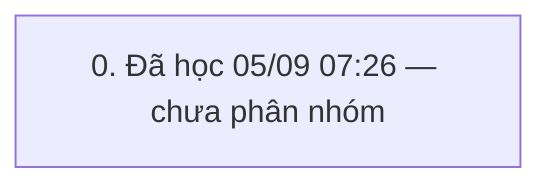

# QUY TRÌNH DON_MOI (`DON_MOI`) — v2

> Trạng thái: **Bản nháp (mới học)** · cập nhật 05/09/2026 07:27 · 1 pha · 15 bước (3 ghi) · KHBL làm 12 · cần kiểm 3 · bỏ 0

Nguồn học: HỌC từ khung 05/09/2026 07:23→23:59 (admin)

## 0. Đã học 05/09 07:26 — chưa phân nhóm

Bảng đổi trong khung: I_CUSTOMER, I_DIEMTICHLUY, I_GOLD_BAL, I_LICHSUTICHLUYDIEM, RetailLog, SYS_BILL_COUNTER, SYS_CODEMASTERS, TRN_DAILY_LOG, TRN_RT_BUYSELL, TRN_RT_BUYSELL_SELL, T_CUSTOMER_DEBT, T_PRODUCT, T_PRODUCT_TRACKING, T_TILL_BAL, T_TILL_TXN, T_TILL_TXN_DETAIL, TonKho, tbc_TinNhan

| # | Bước | Proc | Ghi/đọc | Tham số quan trọng | Bảng đổi | KHBL | Đối chiếu | Ghi chú |
|---|---|---|---|---|---|---|---|---|
| 0.1 | Hệ thống: SYS_LOADCOMBO | `SYS_LOADCOMBO` | đọc | exec [SYS_LOADCOMBO] @pType=N'I_GOLD',@pParam=N'',@ShopID='' | — | KHBL thực hiện | Chưa đối chiếu | — |
| 0.2 | Khách hàng: I_CUSTOMER_Lst | `I_CUSTOMER_Lst` | đọc | exec I_CUSTOMER_Lst @p_CustID='',@p_CustCode=N'',@p_CustName=N'',@p_Address=N'',@p_Phone='',@p_Notes=N'',@p_Active='1',@p_Sort='',@p_CustGroupID='',@p_CustTypeID='',@p_BirthDate='',@p_Gender='',@p_Email='',@p_DateOfJoining='',@p_LastTradingDate='',@p_LoaiGD='SRT',@ShopID='' | — | KHBL thực hiện | Chưa đối chiếu | — |
| 0.3 | Hệ thống: SYS_LOADCOMBO ×2 | `SYS_LOADCOMBO` ×N | đọc | exec [SYS_LOADCOMBO] @pType=N'T_EMPLOYEE',@pParam=N'',@ShopID='' | — | KHBL thực hiện | Chưa đối chiếu | — |
| 0.4 | Sản phẩm/kho: T_PRODUCT_GetByCodeForSell | `T_PRODUCT_GetByCodeForSell` | đọc | exec T_PRODUCT_GetByCodeForSell @p_ProductCode=N'9T60000234',@p_TaskPrice=0,@p_ShopID='',@p_CheckRealSL=1,@p_TillID='TIL110500000001',@p_CustID='',@p_ShopID_XRate='',@p_RutGon='0' | — | KHBL thực hiện | Chưa đối chiếu | — |
| 0.5 | HĐ bán: TRN_RT_BUYSELL_Ins | `TRN_RT_BUYSELL_Ins` | ghi | declare @p25 xml set @p25=convert(xml,N'<NewDataSet><TRN_RT_BUYSELL_SELL><ProductID>PD2608000004564</ProductID><ProductCode>9T60000234</ProductCode><ProductDesc>Bánh kem kitty</ProductDesc><GoldCode>N9999</GoldCode><GoldDesc>99.99</GoldDesc><SectionName>Tượng 9999</SectionName><TaskPrice>490.000</TaskPrice><DiamondWeight>0.0000000000000000000</DiamondWeight><TotalWeight>2.0000000000000000000</Tota | — | Cần kiểm trên sandbox | Chưa đối chiếu | — |
| 0.6 | HĐ bán: TRN_RT_BUYSELL_Get | `TRN_RT_BUYSELL_Get` | đọc | exec TRN_RT_BUYSELL_Get @p_TrnID='TRB260900000607',@p_ShopID_XRate='' | — | KHBL thực hiện | Chưa đối chiếu | — |
| 0.7 | Hệ thống: SYS_LOADCOMBO ×2 | `SYS_LOADCOMBO` ×N | đọc | exec [SYS_LOADCOMBO] @pType=N'I_CUSTOMER_GROUP',@pParam=N'',@ShopID='' | — | KHBL thực hiện | Chưa đối chiếu | — |
| 0.8 | Khác: I_GIAODICH_Lst | `I_GIAODICH_Lst` | đọc | I_GIAODICH_Lst | — | KHBL thực hiện | Chưa đối chiếu | — |
| 0.9 | Khách hàng: I_CUSTOMER_Ins | `I_CUSTOMER_Ins` | ghi | declare @p18 xml set @p18=convert(xml,N'') exec [I_CUSTOMER_Ins] @p_CustID='',@p_CustCode=N'',@p_CustName=N'Chị Tâm',@p_Address=N'',@p_Phone='0386031411',@p_Notes=N'',@p_Active='1',@p_CMND='',@p_CustGroupID='',@p_CustTypeID='',@p_BirthDate='05/09/2026',@p_Gender='0',@p_Email='',@p_DateOfJoining='',@p_LastTradingDate='',@TuDongNangHang='1',@p_Image=NULL,@MaGD=@p18,@p_Company=N'',@p_Company_Address= | — | Cần kiểm trên sandbox | Chưa đối chiếu | — |
| 0.10 | Khách hàng: I_DiemTichLuy_InsFromGT | `I_DiemTichLuy_InsFromGT` | đọc | exec [I_DiemTichLuy_InsFromGT] @p_CustID='CU2609000000194' | — | KHBL thực hiện | Chưa đối chiếu | — |
| 0.11 | Hệ thống: SYS_LOADCOMBO | `SYS_LOADCOMBO` | đọc | exec [SYS_LOADCOMBO] @pType=N'I_GOLD',@pParam=N'',@ShopID='' | — | KHBL thực hiện | Chưa đối chiếu | — |
| 0.12 | Khách hàng: I_CUSTOMER_Lst | `I_CUSTOMER_Lst` | đọc | exec I_CUSTOMER_Lst @p_CustID='',@p_CustCode=N'',@p_CustName=N'',@p_Address=N'',@p_Phone='',@p_Notes=N'',@p_Active='1',@p_Sort='',@p_CustGroupID='',@p_CustTypeID='',@p_BirthDate='',@p_Gender='',@p_Email='',@p_DateOfJoining='',@p_LastTradingDate='',@p_LoaiGD='SRT',@ShopID='' | — | KHBL thực hiện | Chưa đối chiếu | — |
| 0.13 | Hệ thống: SYS_LOADCOMBO ×2 | `SYS_LOADCOMBO` ×N | đọc | exec [SYS_LOADCOMBO] @pType=N'T_EMPLOYEE',@pParam=N'',@ShopID='' | — | KHBL thực hiện | Chưa đối chiếu | — |
| 0.14 | HĐ bán: TRN_RT_BUYSELL_Upd | `TRN_RT_BUYSELL_Upd` | ghi | declare @p29 xml set @p29=convert(xml,N'<NewDataSet><TRN_RT_BUYSELL_SELL><STT>1</STT><ProductID>PD2608000004564</ProductID><ProductCode>9T60000234</ProductCode><ProductDesc>Bánh kem kitty</ProductDesc><GroupID>PG2504000000001</GroupID><PriceCcy>VND</PriceCcy><PriceUnit>L</PriceUnit><CcyRate>1000.000</CcyRate><CcyRateTaskPrice>1000.000</CcyRateTaskPrice><PCcyRate>1000.000</PCcyRate><TotalWeight>2.0 | — | Cần kiểm trên sandbox | Chưa đối chiếu | — |
| 0.15 | HĐ bán: TRN_RT_BUYSELL_Get ×2 | `TRN_RT_BUYSELL_Get` ×N | đọc | exec TRN_RT_BUYSELL_Get @p_TrnID='TRB260900000607',@p_ShopID_XRate='' | — | KHBL thực hiện | Chưa đối chiếu | — |

