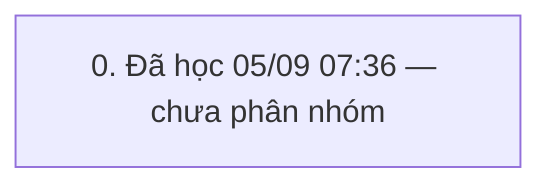

# QUY TRÌNH hóa đơn nhiều món + bớt + thêm + dẻ (`HD_FULL`) — v3

> Trạng thái: **GĐ đã duyệt** · cập nhật 05/09/2026 07:38 · 1 pha · 33 bước (13 ghi) · KHBL làm 20 · cần kiểm 13 · bỏ 0

mã mã sp đang có trong ds chờ -> những đơn khác không thể quét mã được nữa -> cảnh báo

Nguồn học: HỌC từ khung 05/09/2026 07:31→23:59 (admin)

## 0. Đã học 05/09 07:36 — chưa phân nhóm

Bảng đổi trong khung: SYS_BILL_COUNTER, SYS_CODEMASTERS, TRN_RT_BUYSELL, TRN_RT_BUYSELL_BUYGOLD, TRN_RT_BUYSELL_SELL

| # | Bước | Proc | Ghi/đọc | Tham số quan trọng | Bảng đổi | KHBL | Đối chiếu | Ghi chú |
|---|---|---|---|---|---|---|---|---|
| 0.1 | Hệ thống: SYS_LOADCOMBO ×2 | `SYS_LOADCOMBO` ×N | đọc | exec [SYS_LOADCOMBO] @pType=N'I_CURRENCY',@pParam=N'F',@ShopID='' | — | KHBL thực hiện | Chưa đối chiếu | — |
| 0.2 | Khách hàng: I_CUSTOMER_Lst | `I_CUSTOMER_Lst` | đọc | exec I_CUSTOMER_Lst @p_CustID='',@p_CustCode=N'',@p_CustName=N'',@p_Address=N'',@p_Phone='',@p_Notes=N'',@p_Active='1',@p_Sort='',@p_CustGroupID='',@p_CustTypeID='',@p_BirthDate='',@p_Gender='',@p_Email='',@p_DateOfJoining='',@p_LastTradingDate='',@p_LoaiGD='TFX',@ShopID='' | — | KHBL thực hiện | Chưa đối chiếu | — |
| 0.3 | Khách hàng: TRN_FX_CheckCustomer | `TRN_FX_CheckCustomer` | đọc | exec TRN_FX_CheckCustomer @p_CustID='CU2604000001110',@p_ShopID='' | — | KHBL thực hiện | Chưa đối chiếu | — |
| 0.4 | Sản phẩm/kho: T_PRODUCT_GetByCodeForSell | `T_PRODUCT_GetByCodeForSell` | đọc | exec T_PRODUCT_GetByCodeForSell @p_ProductCode=N'2M600171',@p_TaskPrice=0,@p_ShopID='',@p_CheckRealSL=1,@p_TillID='TIL110500000001',@p_CustID='',@p_ShopID_XRate='',@p_RutGon='0' | — | KHBL thực hiện | Chưa đối chiếu | — |
| 0.5 | HĐ bán: TRN_RT_BUYSELL_Ins | `TRN_RT_BUYSELL_Ins` | ghi | declare @p25 xml set @p25=convert(xml,N'<NewDataSet><TRN_RT_BUYSELL_SELL><ProductID>PD2605000005932</ProductID><ProductCode>2M600171</ProductCode><ProductDesc>mặt ovan xanh lá</ProductDesc><PriceCcy>VND</PriceCcy><PriceUnit>L</PriceUnit><CcyRate>1000.000</CcyRate><CcyRateTaskPrice>1000.000</CcyRateTaskPrice><TotalWeight>211.9000000000000000000</TotalWeight><GoldWeight>98.900000000000000000</GoldWe | — | Cần kiểm trên sandbox | Chưa đối chiếu | — |
| 0.6 | HĐ bán: TRN_RT_BUYSELL_Get | `TRN_RT_BUYSELL_Get` | đọc | exec TRN_RT_BUYSELL_Get @p_TrnID='TRB260900000608',@p_ShopID_XRate='' | — | KHBL thực hiện | Chưa đối chiếu | — |
| 0.7 | Sản phẩm/kho: T_PRODUCT_GetByCodeForSell | `T_PRODUCT_GetByCodeForSell` | đọc | exec T_PRODUCT_GetByCodeForSell @p_ProductCode=N'1B60001081',@p_TaskPrice=0,@p_ShopID='',@p_CheckRealSL=1,@p_TillID='TIL110500000001',@p_CustID='',@p_ShopID_XRate='',@p_RutGon='0' | — | KHBL thực hiện | Chưa đối chiếu | — |
| 0.8 | HĐ bán: TRN_RT_BUYSELL_Upd | `TRN_RT_BUYSELL_Upd` | ghi | declare @p29 xml set @p29=convert(xml,N'<NewDataSet><TRN_RT_BUYSELL_SELL><STT>1</STT><ProductID>PD2605000005932</ProductID><ProductCode>2M600171</ProductCode><ProductDesc>mặt ovan xanh lá</ProductDesc><GroupID>PG1411000000013</GroupID><PriceCcy>VND</PriceCcy><PriceUnit>L</PriceUnit><CcyRate>1000.000</CcyRate><CcyRateTaskPrice>1000.000</CcyRateTaskPrice><PCcyRate>1000.000</PCcyRate><TotalWeight>211 | — | Cần kiểm trên sandbox | Chưa đối chiếu | — |
| 0.9 | HĐ bán: TRN_RT_BUYSELL_Get | `TRN_RT_BUYSELL_Get` | đọc | exec TRN_RT_BUYSELL_Get @p_TrnID='TRB260900000608',@p_ShopID_XRate='' | — | KHBL thực hiện | Chưa đối chiếu | — |
| 0.10 | Sản phẩm/kho: T_PRODUCT_GetByCodeForSell | `T_PRODUCT_GetByCodeForSell` | đọc | exec T_PRODUCT_GetByCodeForSell @p_ProductCode=N'1C60003197',@p_TaskPrice=0,@p_ShopID='',@p_CheckRealSL=1,@p_TillID='TIL110500000001',@p_CustID='',@p_ShopID_XRate='',@p_RutGon='0' | — | KHBL thực hiện | Chưa đối chiếu | — |
| 0.11 | HĐ bán: TRN_RT_BUYSELL_Upd | `TRN_RT_BUYSELL_Upd` | ghi | declare @p29 xml set @p29=convert(xml,N'<NewDataSet><TRN_RT_BUYSELL_SELL><STT>1</STT><ProductID>PD2605000005932</ProductID><ProductCode>2M600171</ProductCode><ProductDesc>mặt ovan xanh lá</ProductDesc><GroupID>PG1411000000013</GroupID><PriceCcy>VND</PriceCcy><PriceUnit>L</PriceUnit><CcyRate>1000.000</CcyRate><CcyRateTaskPrice>1000.000</CcyRateTaskPrice><PCcyRate>1000.000</PCcyRate><TotalWeight>211 | — | Cần kiểm trên sandbox | Chưa đối chiếu | — |
| 0.12 | HĐ bán: TRN_RT_BUYSELL_Get | `TRN_RT_BUYSELL_Get` | đọc | exec TRN_RT_BUYSELL_Get @p_TrnID='TRB260900000608',@p_ShopID_XRate='' | — | KHBL thực hiện | Chưa đối chiếu | — |
| 0.13 | Sản phẩm/kho: T_PRODUCT_GetByCodeForSell | `T_PRODUCT_GetByCodeForSell` | đọc | exec T_PRODUCT_GetByCodeForSell @p_ProductCode=N'9N60016834',@p_TaskPrice=0,@p_ShopID='',@p_CheckRealSL=1,@p_TillID='TIL110500000001',@p_CustID='',@p_ShopID_XRate='',@p_RutGon='0' | — | KHBL thực hiện | Chưa đối chiếu | — |
| 0.14 | HĐ bán: TRN_RT_BUYSELL_Upd | `TRN_RT_BUYSELL_Upd` | ghi | declare @p29 xml set @p29=convert(xml,N'<NewDataSet><TRN_RT_BUYSELL_SELL><STT>1</STT><ProductID>PD2605000005932</ProductID><ProductCode>2M600171</ProductCode><ProductDesc>mặt ovan xanh lá</ProductDesc><GroupID>PG1411000000013</GroupID><PriceCcy>VND</PriceCcy><PriceUnit>L</PriceUnit><CcyRate>1000.000</CcyRate><CcyRateTaskPrice>1000.000</CcyRateTaskPrice><PCcyRate>1000.000</PCcyRate><TotalWeight>211 | — | Cần kiểm trên sandbox | Chưa đối chiếu | — |
| 0.15 | HĐ bán: TRN_RT_BUYSELL_Get | `TRN_RT_BUYSELL_Get` | đọc | exec TRN_RT_BUYSELL_Get @p_TrnID='TRB260900000608',@p_ShopID_XRate='' | — | KHBL thực hiện | Chưa đối chiếu | — |
| 0.16 | HĐ bán: TRN_RT_BUYSELL_Upd | `TRN_RT_BUYSELL_Upd` | ghi | declare @p29 xml set @p29=convert(xml,N'<NewDataSet><TRN_RT_BUYSELL_SELL><STT>1</STT><ProductID>PD2605000005932</ProductID><ProductCode>2M600171</ProductCode><ProductDesc>mặt ovan xanh lá</ProductDesc><GroupID>PG1411000000013</GroupID><PriceCcy>VND</PriceCcy><PriceUnit>L</PriceUnit><CcyRate>1000.000</CcyRate><CcyRateTaskPrice>1000.000</CcyRateTaskPrice><PCcyRate>1000.000</PCcyRate><TotalWeight>211 | — | Cần kiểm trên sandbox | Chưa đối chiếu | — |
| 0.17 | HĐ bán: TRN_RT_BUYSELL_Get | `TRN_RT_BUYSELL_Get` | đọc | exec TRN_RT_BUYSELL_Get @p_TrnID='TRB260900000608',@p_ShopID_XRate='' | — | KHBL thực hiện | Chưa đối chiếu | — |
| 0.18 | HĐ bán: TRN_RT_BUYSELL_Upd | `TRN_RT_BUYSELL_Upd` | ghi | declare @p29 xml set @p29=convert(xml,N'<NewDataSet><TRN_RT_BUYSELL_SELL><STT>1</STT><ProductID>PD2605000005932</ProductID><ProductCode>2M600171</ProductCode><ProductDesc>mặt ovan xanh lá</ProductDesc><GroupID>PG1411000000013</GroupID><PriceCcy>VND</PriceCcy><PriceUnit>L</PriceUnit><CcyRate>1000.000</CcyRate><CcyRateTaskPrice>1000.000</CcyRateTaskPrice><PCcyRate>1000.000</PCcyRate><TotalWeight>211 | — | Cần kiểm trên sandbox | Chưa đối chiếu | — |
| 0.19 | HĐ bán: TRN_RT_BUYSELL_Get | `TRN_RT_BUYSELL_Get` | đọc | exec TRN_RT_BUYSELL_Get @p_TrnID='TRB260900000608',@p_ShopID_XRate='' | — | KHBL thực hiện | Chưa đối chiếu | — |
| 0.20 | HĐ bán: TRN_RT_BUYSELL_Upd | `TRN_RT_BUYSELL_Upd` | ghi | declare @p29 xml set @p29=convert(xml,N'<NewDataSet><TRN_RT_BUYSELL_SELL><STT>1</STT><ProductID>PD2605000005932</ProductID><ProductCode>2M600171</ProductCode><ProductDesc>mặt ovan xanh lá</ProductDesc><GroupID>PG1411000000013</GroupID><PriceCcy>VND</PriceCcy><PriceUnit>L</PriceUnit><CcyRate>1000.000</CcyRate><CcyRateTaskPrice>1000.000</CcyRateTaskPrice><PCcyRate>1000.000</PCcyRate><TotalWeight>211 | — | Cần kiểm trên sandbox | Chưa đối chiếu | — |
| 0.21 | HĐ bán: TRN_RT_BUYSELL_Get | `TRN_RT_BUYSELL_Get` | đọc | exec TRN_RT_BUYSELL_Get @p_TrnID='TRB260900000608',@p_ShopID_XRate='' | — | KHBL thực hiện | Chưa đối chiếu | — |
| 0.22 | HĐ bán: TRN_RT_BUYSELL_Upd | `TRN_RT_BUYSELL_Upd` | ghi | declare @p29 xml set @p29=convert(xml,N'<NewDataSet><TRN_RT_BUYSELL_SELL><STT>1</STT><ProductID>PD2605000005932</ProductID><ProductCode>2M600171</ProductCode><ProductDesc>mặt ovan xanh lá</ProductDesc><GroupID>PG1411000000013</GroupID><PriceCcy>VND</PriceCcy><PriceUnit>L</PriceUnit><CcyRate>1000.000</CcyRate><CcyRateTaskPrice>1000.000</CcyRateTaskPrice><PCcyRate>1000.000</PCcyRate><TotalWeight>211 | — | Cần kiểm trên sandbox | Chưa đối chiếu | — |
| 0.23 | HĐ bán: TRN_RT_BUYSELL_Get | `TRN_RT_BUYSELL_Get` | đọc | exec TRN_RT_BUYSELL_Get @p_TrnID='TRB260900000608',@p_ShopID_XRate='' | — | KHBL thực hiện | Chưa đối chiếu | — |
| 0.24 | HĐ bán: TRN_RT_BUYSELL_Upd | `TRN_RT_BUYSELL_Upd` | ghi | declare @p29 xml set @p29=convert(xml,N'<NewDataSet><TRN_RT_BUYSELL_SELL><STT>1</STT><ProductID>PD2605000005932</ProductID><ProductCode>2M600171</ProductCode><ProductDesc>mặt ovan xanh lá</ProductDesc><GroupID>PG1411000000013</GroupID><PriceCcy>VND</PriceCcy><PriceUnit>L</PriceUnit><CcyRate>1000.000</CcyRate><CcyRateTaskPrice>1000.000</CcyRateTaskPrice><PCcyRate>1000.000</PCcyRate><TotalWeight>211 | — | Cần kiểm trên sandbox | Chưa đối chiếu | — |
| 0.25 | HĐ bán: TRN_RT_BUYSELL_Get | `TRN_RT_BUYSELL_Get` | đọc | exec TRN_RT_BUYSELL_Get @p_TrnID='TRB260900000608',@p_ShopID_XRate='' | — | KHBL thực hiện | Chưa đối chiếu | — |
| 0.26 | HĐ bán: TRN_RT_BUYSELL_Upd | `TRN_RT_BUYSELL_Upd` | ghi | declare @p29 xml set @p29=convert(xml,N'<NewDataSet><TRN_RT_BUYSELL_SELL><STT>1</STT><ProductID>PD2605000005932</ProductID><ProductCode>2M600171</ProductCode><ProductDesc>mặt ovan xanh lá</ProductDesc><GroupID>PG1411000000013</GroupID><PriceCcy>VND</PriceCcy><PriceUnit>L</PriceUnit><CcyRate>1000.000</CcyRate><CcyRateTaskPrice>1000.000</CcyRateTaskPrice><PCcyRate>1000.000</PCcyRate><TotalWeight>211 | — | Cần kiểm trên sandbox | Chưa đối chiếu | — |
| 0.27 | HĐ bán: TRN_RT_BUYSELL_Get | `TRN_RT_BUYSELL_Get` | đọc | exec TRN_RT_BUYSELL_Get @p_TrnID='TRB260900000608',@p_ShopID_XRate='' | — | KHBL thực hiện | Chưa đối chiếu | — |
| 0.28 | HĐ bán: TRN_RT_BUYSELL_Upd | `TRN_RT_BUYSELL_Upd` | ghi | declare @p29 xml set @p29=convert(xml,N'<NewDataSet><TRN_RT_BUYSELL_SELL><STT>1</STT><ProductID>PD2605000005932</ProductID><ProductCode>2M600171</ProductCode><ProductDesc>mặt ovan xanh lá</ProductDesc><GroupID>PG1411000000013</GroupID><PriceCcy>VND</PriceCcy><PriceUnit>L</PriceUnit><CcyRate>1000.000</CcyRate><CcyRateTaskPrice>1000.000</CcyRateTaskPrice><PCcyRate>1000.000</PCcyRate><TotalWeight>211 | — | Cần kiểm trên sandbox | Chưa đối chiếu | — |
| 0.29 | HĐ bán: TRN_RT_BUYSELL_Get | `TRN_RT_BUYSELL_Get` | đọc | exec TRN_RT_BUYSELL_Get @p_TrnID='TRB260900000608',@p_ShopID_XRate='' | — | KHBL thực hiện | Chưa đối chiếu | — |
| 0.30 | HĐ bán: TRN_RT_BUYSELL_Upd | `TRN_RT_BUYSELL_Upd` | ghi | declare @p29 xml set @p29=convert(xml,N'<NewDataSet><TRN_RT_BUYSELL_SELL><STT>1</STT><ProductID>PD2605000005932</ProductID><ProductCode>2M600171</ProductCode><ProductDesc>mặt ovan xanh lá</ProductDesc><GroupID>PG1411000000013</GroupID><PriceCcy>VND</PriceCcy><PriceUnit>L</PriceUnit><CcyRate>1000.000</CcyRate><CcyRateTaskPrice>1000.000</CcyRateTaskPrice><PCcyRate>1000.000</PCcyRate><TotalWeight>211 | — | Cần kiểm trên sandbox | Chưa đối chiếu | — |
| 0.31 | HĐ bán: TRN_RT_BUYSELL_Get | `TRN_RT_BUYSELL_Get` | đọc | exec TRN_RT_BUYSELL_Get @p_TrnID='TRB260900000608',@p_ShopID_XRate='' | — | KHBL thực hiện | Chưa đối chiếu | — |
| 0.32 | HĐ bán: TRN_RT_BUYSELL_Upd | `TRN_RT_BUYSELL_Upd` | ghi | declare @p29 xml set @p29=convert(xml,N'<NewDataSet><TRN_RT_BUYSELL_SELL><STT>1</STT><ProductID>PD2605000005932</ProductID><ProductCode>2M600171</ProductCode><ProductDesc>mặt ovan xanh lá</ProductDesc><GroupID>PG1411000000013</GroupID><PriceCcy>VND</PriceCcy><PriceUnit>L</PriceUnit><CcyRate>1000.000</CcyRate><CcyRateTaskPrice>1000.000</CcyRateTaskPrice><PCcyRate>1000.000</PCcyRate><TotalWeight>211 | — | Cần kiểm trên sandbox | Chưa đối chiếu | — |
| 0.33 | HĐ bán: TRN_RT_BUYSELL_Get | `TRN_RT_BUYSELL_Get` | đọc | exec TRN_RT_BUYSELL_Get @p_TrnID='TRB260900000608',@p_ShopID_XRate='' | — | KHBL thực hiện | Chưa đối chiếu | — |

