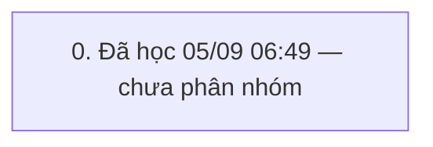

# QUY TRÌNH Hủy đơn đã chốt (`HUY_HOA_DON`) — v3

> Trạng thái: **GĐ đã duyệt** · cập nhật 05/09/2026 06:51 · 1 pha · 4 bước (2 ghi) · KHBL làm 2 · cần kiểm 2 · bỏ 0

Xóa hóa đơn đã chốt

Nguồn học: HỌC từ khung 05/09/2026 06:46→23:59 (admin)

## 0. Đã học 05/09 06:49 — chưa phân nhóm

Bảng đổi trong khung: ErrorLog, I_CUSTOMER, I_GOLD_BAL, I_LICHSUTICHLUYDIEM, TRN_DAILY_LOG, TRN_RT_BUYSELL, TRN_RT_BUYSELL_Log, TRN_RT_BUYSELL_SELL, TRN_RT_BUYSELL_SELL_Log, T_PRODUCT, T_PRODUCT_TRACKING, T_TILL_BAL, T_TILL_TXN, T_TILL_TXN_DETAIL, T_TILL_TXN_DETAIL_Log, T_TILL_TXN_Log, TonKho

| # | Bước | Proc | Ghi/đọc | Tham số quan trọng | Bảng đổi | KHBL | Đối chiếu | Ghi chú |
|---|---|---|---|---|---|---|---|---|
| 0.1 | Sổ quỹ: T_TILL_TXN_Lst | `T_TILL_TXN_Lst` | đọc | exec T_TILL_TXN_Lst @p_TillTxnID='',@p_TillID='',@p_TrnRefID='',@p_TrnFromDate='05/09/2026',@p_TrnToDate='05/09/2026',@p_FromTime='06:48:31',@p_ToTime='06:48:31',@p_TrnType='',@p_TrnCode='',@p_CustID='',@p_GoldCcy='',@p_TrnAmount='',@p_Status='P',@p_TillUserID='',@p_Sort='',@p_ProcUserID='',@p_ShopID='',@p_BillCode=N'',@p_Description=N'',@p_RutGon='0' | — | KHBL thực hiện | Chưa đối chiếu | — |
| 0.2 | Sổ quỹ: T_TILL_TXN_Del | `T_TILL_TXN_Del` | ghi | exec [T_TILL_TXN_Del] @p_TrnRefID='TRB260900000604',@pType=N'SRT',@pCongNoBanLe=0,@p_UserUpd='US1806000000001',@p_TrnDateTime_Upd='Sep 5 2026 5:58:09:967AM',@p_TrnDateTime_Upd_GDN='Jan 1 1900 12:00:00:000AM',@p_Type='1' | — | Cần kiểm trên sandbox | Chưa đối chiếu | — |
| 0.3 | HĐ bán: TRN_RT_BUYSELL_Del | `TRN_RT_BUYSELL_Del` | ghi | exec TRN_RT_BUYSELL_Del @p_TrnID='TRB260900000604',@p_UserUpd='US1806000000001',@p_TrnDateTime_Upd='Sep 5 2026 6:48:49:990AM',@p_TrnDateTime_Upd_GDN='Jan 1 1900 12:00:00:000AM',@p_LogDel='0' | — | Cần kiểm trên sandbox | Chưa đối chiếu | — |
| 0.4 | Sổ quỹ: T_TILL_TXN_Lst | `T_TILL_TXN_Lst` | đọc | exec T_TILL_TXN_Lst @p_TillTxnID='',@p_TillID='',@p_TrnRefID='',@p_TrnFromDate='05/09/2026',@p_TrnToDate='05/09/2026',@p_FromTime='06:48:31',@p_ToTime='06:48:31',@p_TrnType='',@p_TrnCode='',@p_CustID='',@p_GoldCcy='',@p_TrnAmount='',@p_Status='P',@p_TillUserID='',@p_Sort='',@p_ProcUserID='',@p_ShopID='',@p_BillCode=N'',@p_Description=N'',@p_RutGon='0' | — | KHBL thực hiện | Chưa đối chiếu | — |

