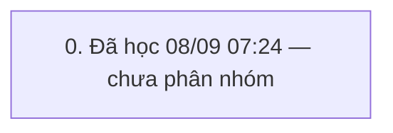

# QUY TRÌNH Hủy đơn thâu vàng (`HUY_THAU_VAO`) — v2

> Trạng thái: **GĐ đã duyệt** · cập nhật 08/09/2026 07:25 · 1 pha · 5 bước (4 ghi) · KHBL làm 1 · cần kiểm 4 · bỏ 0

Nguồn học: HỌC từ đánh dấu seq 2335072→2335879 (08/09/2026 07:24, admin)

## 0. Đã học 08/09 07:24 — chưa phân nhóm

Bảng đổi trong khung: ErrorLog, I_CUSTOMER, I_LICHSUTICHLUYDIEM, TRN_RT_BUYGOLD, TRN_RT_BUYGOLD_Log, T_TILL_BAL, T_TILL_TXN, T_TILL_TXN_DETAIL, T_TILL_TXN_DETAIL_Log, T_TILL_TXN_Log

| # | Bước | Proc | Ghi/đọc | Tham số quan trọng | Bảng đổi | KHBL | Đối chiếu | Ghi chú |
|---|---|---|---|---|---|---|---|---|
| 0.1 | Sổ quỹ: T_TILL_TXN_Del | `T_TILL_TXN_Del` | ghi | exec [T_TILL_TXN_Del] @p_TrnRefID='TBG260900000371',@pType=N'BRT',@pCongNoBanLe=0,@p_UserUpd='US2410000000001',@p_TrnDateTime_Upd='Sep 8 2026 7:18:42:790AM',@p_TrnDateTime_Upd_GDN='Jan 1 1900 12:00:00:000AM',@p_Type='1' | — | Cần kiểm trên sandbox | Chưa đối chiếu | — |
| 0.2 | HĐ thâu: TRN_RT_BUYGOLD_Del | `TRN_RT_BUYGOLD_Del` | ghi | exec TRN_RT_BUYGOLD_Del @p_TrnID='TBG260900000371',@p_UserUpd='US2410000000001',@p_TrnDateTime_Upd='Sep 8 2026 7:23:12:657AM',@p_TrnDateTime_Upd_GDN='Jan 1 1900 12:00:00:000AM',@p_TrnID_GDN='' | — | Cần kiểm trên sandbox | Chưa đối chiếu | — |
| 0.3 | Sổ quỹ: T_TILL_TXN_Del | `T_TILL_TXN_Del` | ghi | exec [T_TILL_TXN_Del] @p_TrnRefID='TBG260900000370',@pType=N'BRT',@pCongNoBanLe=0,@p_UserUpd='US2410000000001',@p_TrnDateTime_Upd='Sep 8 2026 7:18:42:883AM',@p_TrnDateTime_Upd_GDN='Jan 1 1900 12:00:00:000AM',@p_Type='1' | — | Cần kiểm trên sandbox | Chưa đối chiếu | — |
| 0.4 | HĐ thâu: TRN_RT_BUYGOLD_Del | `TRN_RT_BUYGOLD_Del` | ghi | exec TRN_RT_BUYGOLD_Del @p_TrnID='TBG260900000370',@p_UserUpd='US2410000000001',@p_TrnDateTime_Upd='Sep 8 2026 7:23:15:597AM',@p_TrnDateTime_Upd_GDN='Jan 1 1900 12:00:00:000AM',@p_TrnID_GDN='' | — | Cần kiểm trên sandbox | Chưa đối chiếu | — |
| 0.5 | Sổ quỹ: T_TILL_TXN_Lst | `T_TILL_TXN_Lst` | đọc | exec T_TILL_TXN_Lst @p_TillTxnID='',@p_TillID='',@p_TrnRefID='',@p_TrnFromDate='08/09/2026',@p_TrnToDate='08/09/2026',@p_FromTime='07:21:41',@p_ToTime='07:21:41',@p_TrnType='',@p_TrnCode='',@p_CustID='',@p_GoldCcy='',@p_TrnAmount='',@p_Status='P',@p_TillUserID='',@p_Sort='',@p_ProcUserID='',@p_ShopID='',@p_BillCode=N'',@p_Description=N'',@p_RutGon='0' | — | KHBL thực hiện | Chưa đối chiếu | — |

