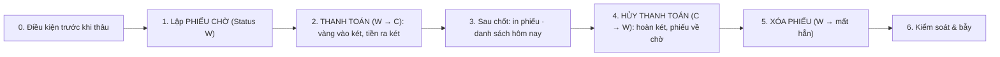

# QUY TRÌNH Thâu vàng — FULL: lập phiếu chờ → THANH TOÁN (tiền mặt / CK) → in 110mm · hủy thanh toán · xóa phiếu (`THAU_VANG`) — v2

> Trạng thái: **GĐ đã duyệt** · cập nhật 08/09/2026 16:53 · 7 pha · 19 bước (9 ghi) · KHBL làm 17 · cần kiểm 0 · bỏ 2

Vòng đời phiếu thâu độc lập TRN_RT_BUYGOLD trên PMVGoldRT, đo thật 08/09/2026 và đối chiếu thân proc. TRẠNG THÁI: chưa có → W (phiếu CHỜ, BillCode sinh NGAY lúc Ins vì TaoSoHDKhiThanhToan=0) → C (ĐÃ THANH TOÁN: vàng vào két, tiền ra két, cộng điểm, LastTradingDate) ⇄ hủy thanh toán về W → xóa CỨNG (không IsDel; vết chỉ còn ở *_Log do T_TILL_TXN_Del ghi — phiếu W chưa từng thanh toán bị xóa KHÔNG có log vendor, web tự ghi audit). Tiền: TotalAmount = tròn(GoldWeight(ly, đã trừ hột) ÷ 100 × BuyRate(nghìn/chỉ) × 1.000 × %tuổi ÷ 100) + AddMoney; hột không tính tiền nhưng vào két (Amount_Total). Thanh toán CK: CardPay = −CK, CashPay = −tiền mặt, dòng VND két = tiền mặt.

Nguồn học: GỘP 2 quy trình GĐ học 08/09/2026: THAU_VAO (seq 2336761→2337597, TBG260900000373 tiền mặt) + HUY_THAU_VAO (seq 2335072→2335879, hủy 2 phiếu 370/371 đã C). Đối chiếu thêm dòng KK thật 372/391/395 (CK: CashPay=0, CardPay=−tổng, dòng VND két = 0, có TRN_RT_BUYGOLD_CardPay do app) và thân proc sandbox. GĐ duyệt 3 chốt 08/09/2026 (docstring).

## 0. Điều kiện trước khi thâu

Két/EmpID/TillID/ShopID của user (sys_users) · giá THÂU lấy từ MySQL gold_prices (như bán) · khách có sẵn / tạo mới / vãng lai.

| # | Bước | Proc | Ghi/đọc | Tham số quan trọng | Bảng đổi | KHBL | Đối chiếu | Ghi chú |
|---|---|---|---|---|---|---|---|---|
| 0.1 | Tài khoản gắn két + NV + tiệm | — | — | TillID = két user (TIL…); rỗng → CHẶN vì TRN_TILL_TXN_Ins để TillID NULL tới khi T_TILL_TXN_Proc | — | KHBL thực hiện | Khớp app | KHBL: _phien(request) — thiếu till_id/user_id/shop_id thì không cho LƯU/THANH TOÁN |
| 0.2 | Giá thâu theo mã dẻ | — | đọc | BuyRate D18K/D24K/D9999… — KHBL: MySQL gold_prices quy về nghìn/chỉ (services.loai_vang_thau) | — | KHBL thực hiện | Khớp app | App đọc I_XRATE; web ép giá MySQL lúc lưu, không nhận giá tay |
| 0.3 | Khách: có sẵn · tạo mới · vãng lai | `I_CUSTOMER_Ins` | ghi | Tạo mới = quy trình THEM_KHACH (I_CUSTOMER_Ins → I_DiemTichLuy_InsFromGT); không chọn = CU0000000000000 (không tích điểm) | I_CUSTOMER, I_DIEMTICHLUY | KHBL thực hiện | Khớp app | Popup ＋ THÊM dùng chung với DS khách (khachSaved → gắn vào phiếu) |

## 1. Lập PHIẾU CHỜ (Status W)

GĐ CHỐT 1: Ins khi bấm LƯU NHÁP / THANH TOÁN (không Ins ngầm lúc đang tính thử). BỎ bước Upd thừa của app ngay sau Ins.

| # | Bước | Proc | Ghi/đọc | Tham số quan trọng | Bảng đổi | KHBL | Đối chiếu | Ghi chú |
|---|---|---|---|---|---|---|---|---|
| 1.1 | Lập phiếu | `TRN_RT_BUYGOLD_Ins` | ghi | p_TrnID='' · p_TrnDate/p_TrnTime (proc BỎ, dùng GETDATE KK) · p_EmpID · p_CustID · p_GoldCode · p_GoldWeight ly ĐÃ TRỪ hột · p_DiamondWeight · p_BuyRate nghìn/chỉ · p_PercentValue · p_TotalAmount · p_CustPay=TotalAmount · p_AddMoney · p_GoldAge=p_AgeChange='1' · p_Dirty/TruLai/TruGia/TruDoTrenChi=0 · p_GoldWeightChange=GoldWeight · p_TillID · p_PriceCcy='VND' · p_CcyRate='1000' · p_ShopID · p_CreatedBy=UserID · p_TrnID_GDN='' · p_SoHDTuNhap='' | TRN_RT_BUYGOLD +1 (W) · SYS_CODEMASTERS (TrnID) · SYS_BILL_COUNTER (BillCode BRT) | KHBL thực hiện | Khớp app | Trả ErrCode/TrnID/ErrorDesc. Phiếu W bỏ dở vẫn chiếm 1 số hóa đơn (như app). bill.luu_thau |
| 1.2 | Đọc lại lấy mốc khóa lạc quan | — | đọc | SELECT TrnDateTime_Upd, BillCode, TotalAmount FROM TRN_RT_BUYGOLD WHERE TrnID=? — kiểm tiền khớp | — | KHBL thực hiện | Khớp app | bill.phieu_thau; Complete KHÔNG đổi mốc, Upd/T_TILL_TXN_Del CÓ đổi |
| 1.3 | Sửa phiếu chờ (đổi TL/giá/khách/ghi chú) | `TRN_RT_BUYGOLD_Upd` ×N | ghi | Bộ tham số như Ins + p_TrnID · p_UserUpd · p_IsGiaoDichNhanh='0' · p_CreatedDate=NULL · p_TrnDateTime_Upd = mốc vừa đọc | TRN_RT_BUYGOLD (TrnDateTime_Upd đổi) | KHBL thực hiện | Khớp app | goi_co_khoa + kiểm mốc đã đổi; phiếu C → vendor từ chối B-002. App gọi Upd THỪA ngay sau Ins — web bỏ (GĐ chốt 1) |

## 2. THANH TOÁN (W → C): vàng vào két, tiền ra két

Chuỗi app đo 07:25:39: CompleteMore → T_TILL_TXN_DETAIL_GetByTrnID → T_TILL_TXN_Proc. CK: chèn CARDPAY_Ins giữa 2 bước (GĐ chốt 2).

| # | Bước | Proc | Ghi/đọc | Tham số quan trọng | Bảng đổi | KHBL | Đối chiếu | Ghi chú |
|---|---|---|---|---|---|---|---|---|
| 2.1 | Chốt phiếu | `TRN_RT_BUYGOLD_CompleteMore` | ghi | @p_TrnIDs='TBG…@' (đuôi @) → lặp TRN_RT_BUYGOLD_Complete: Status='C' · TRN_TILL_TXN_Ins (T_TILL_TXN 'U' TillID NULL + DETAIL dẻ '+' TL/hột/dirty, VND '−' TotalAmount) · tích điểm (I_QuyDiemTichLuy → I_LichSuTLD_Ins → I_DiemTichLuy_Ins) · I_CUSTOMER.LastTradingDate=hôm nay | TRN_RT_BUYGOLD (C) · T_TILL_TXN +1 · T_TILL_TXN_DETAIL +2 · I_LICHSUTICHLUYDIEM +1 · I_DIEMTICHLUY · I_CUSTOMER | KHBL thực hiện | Khớp app | Từ chối BRT-001 (đã C) / B-001 (không có phiếu). KHÔNG đổi TrnDateTime_Upd. bill.chot_thau |
| 2.2 | Kiểm chứng sau chốt | — | đọc | Status='C' + có dòng T_TILL_TXN 'U' theo TrnRefID (app: T_TILL_TXN_DETAIL_GetByTrnID) | — | KHBL thực hiện | Khớp app | không tin rc=0 trần |
| 2.3 | Có CHUYỂN KHOẢN / thẻ → ghi CardPay + sửa dòng VND két | `CARDPAY_Ins` | ghi | @p_TypeTrade='BRT' · @p_TrnID · @p_TillID · @p_TillTxnID (dòng 'U' vừa tạo) · @p_Amount=−CK · @p_AmountTra=−tiền mặt · @p_List='<NewDataSet/>' (DS thẻ RỖNG → không INSERT TRN_RT_BUYGOLD_CardPay) · @p_ProductIDs=NULL (⚠ '' sẽ rẽ nhánh SRT sai) | TRN_RT_BUYGOLD (CashPay/CardPay) · T_TILL_TXN.TrnTotalAmount=tiền mặt · T_TILL_TXN_DETAIL VND=tiền mặt | KHBL thực hiện | Khớp app | GĐ chốt 2: KHÔNG cần dòng TRN_RT_BUYGOLD_CardPay. App CK thật (372): CashPay=0, CardPay=−tổng, VND két 0. Kiểm đọc lại CardPay + TrnTotalAmount |
| 2.4 | Két nhận: vàng +, tiền − | `T_TILL_TXN_Proc` | ghi | @p_TrnIDs='TBG…@' · @p_TillID=két user · @p_UserID → T_TILL_TXN/DETAIL Status 'P' + TillID · T_TILL_BAL dẻ +TL, VND −tiền mặt (tạo dòng két nếu chưa có) | T_TILL_TXN · T_TILL_TXN_DETAIL · T_TILL_BAL | KHBL thực hiện | Khớp app | Từ chối BRT-002 nếu dòng két không còn 'U'. Không có khóa lạc quan → kiểm T_TILL_TXN.Status='P' & TillID |
| 2.5 | Mẫu SMS | `SYS_Notification_Templates_Check` | đọc | @p_TrnCode='BRT' → 0 dòng | — | Ngoài phạm vi — bỏ | Khớp app | Tiệm không dùng SMS — bỏ |

## 3. Sau chốt: in phiếu · danh sách hôm nay

GĐ CHỐT 3: phiếu in RIÊNG khổ máy in bill 110mm (_thau_phieu.html), in THẲNG từ cửa sổ đang mở (#pos-in) như GĐB.

| # | Bước | Proc | Ghi/đọc | Tham số quan trọng | Bảng đổi | KHBL | Đối chiếu | Ghi chú |
|---|---|---|---|---|---|---|---|---|
| 3.1 | Đọc phiếu để in / DS hôm nay | `TRN_RT_BUYGOLD_Lst` ×N | đọc | App: @p_TrnID='TBG…@' · KHBL: SELECT thẳng có NOLOCK (bill.phieu_thau, services.hoa_don_loc loai THAU) | — | KHBL thực hiện | Khớp app | Phiếu 110mm: tiệm · số phiếu · ngày giờ · NV · khách · loại/TL/hột/tuổi/giá · tiền vàng · bù/bớt · TIỆM TRẢ · tiền mặt/CK · bằng chữ · 2 chữ ký |

## 4. HỦY THANH TOÁN (C → W): hoàn két, phiếu về chờ

Đo 07:23: T_TILL_TXN_Del BRT với mốc HIỆN TẠI của phiếu (= mốc lần Upd cuối vì Complete không đổi mốc).

| # | Bước | Proc | Ghi/đọc | Tham số quan trọng | Bảng đổi | KHBL | Đối chiếu | Ghi chú |
|---|---|---|---|---|---|---|---|---|
| 4.1 | Hoàn két + về W | `T_TILL_TXN_Del` | ghi | @p_TrnRefID · @pType='BRT' · @pCongNoBanLe=0 · @p_UserUpd · @p_TrnDateTime_Upd = mốc TRN_RT_BUYGOLD · @p_TrnDateTime_Upd_GDN='1900-01-01' · @p_Type='1' | TRN_RT_BUYGOLD_Log +1 · T_TILL_TXN_Log/_DETAIL_Log +1 · T_TILL_BAL hoàn · T_TILL_TXN/DETAIL −1 · I_LICHSUTICHLUYDIEM (đảo điểm) · TRN_RT_BUYGOLD (W, mốc đổi) | KHBL thực hiện | Khớp app | Đã chạy thật (hoa_don_huy loại THAU → bill.mo_lai_thau, goi_co_khoa kiểm Status W). Mốc lệch → rc=0 mà không làm gì |

## 5. XÓA PHIẾU (W → mất hẳn)

Del xóa CỨNG TRN_RT_BUYGOLD + _DT; từ chối phiếu C (B-002) → phải qua pha 4 trước. Passcode + chỉ phiếu hôm nay (Admin: mọi ngày).

| # | Bước | Proc | Ghi/đọc | Tham số quan trọng | Bảng đổi | KHBL | Đối chiếu | Ghi chú |
|---|---|---|---|---|---|---|---|---|
| 5.1 | Xóa phiếu chờ | `TRN_RT_BUYGOLD_Del` | ghi | @p_TrnID · @p_UserUpd · @p_TrnDateTime_Upd = mốc MỚI (đọc lại sau pha 4) · @p_TrnDateTime_Upd_GDN='1900-01-01' · @p_TrnID_GDN='' | TRN_RT_BUYGOLD −1 · TRN_RT_BUYGOLD_DT | KHBL thực hiện | Khớp app | Đã chạy thật (bill.huy_thau: tự mo_lai nếu C rồi Del, kiểm dòng mất). Phiếu W chưa từng C → vendor KHÔNG log → web canh_bao/audit |
| 5.2 | Đọc lại sổ quỹ | `T_TILL_TXN_Lst` | đọc | App đọc lại DS két sau hủy — KHBL kiểm bằng SELECT | — | KHBL thực hiện | Khớp app | — |
| 5.3 | Xóa cứng hàng loạt của vendor | `DEL_TRN_RT_BUYGOLD` | ghi | Tắt constraint toàn DB (sp_msforeachtable NOCHECK), xóa T_TILL_TXN Status P | — | Ngoài phạm vi — bỏ | Khớp app | CẤM — không bao giờ vào allowlist |

## 6. Kiểm soát & bẫy

Mốc khóa im lặng · TillID NULL · BillCode ăn số ngay ở Ins · không có TRN_DAILY_LOG/I_GOLD_BAL cho thâu (chỉ T_TILL_BAL) · giờ KK chậm ~37s.

| # | Bước | Proc | Ghi/đọc | Tham số quan trọng | Bảng đổi | KHBL | Đối chiếu | Ghi chú |
|---|---|---|---|---|---|---|---|---|
| 6.1 | Phiếu chờ treo | — | đọc | DS hôm nay hiện phiếu W kèm nút MỞ/XÓA; không tự xóa | — | KHBL thực hiện | Khớp app | — |
| 6.2 | Khóa ghi vendor | — | — | pmv_write_lock=1 (check_pmv thấy tbh_VersionDB đổi) → gateway chặn mọi bước ghi | — | KHBL thực hiện | Khớp app | RULE 7 |
| 6.3 | Đối chiếu bảng sau 1 phiếu chốt | — | đọc | 10 bảng: SYS_CODEMASTERS · SYS_BILL_COUNTER · TRN_RT_BUYGOLD · T_TILL_TXN · T_TILL_TXN_DETAIL · T_TILL_BAL · I_LICHSUTICHLUYDIEM · I_DIEMTICHLUY · I_CUSTOMER · ErrorLog (vết chạy, không phải lỗi) | — | KHBL thực hiện | Khớp app | smoke_thau so số dòng/số dư két trước–sau trên sandbox; ĐÁNH DẤU trước/sau khi chạy thật lần đầu |

