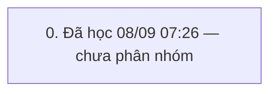

# QUY TRÌNH ĐƠN thâu vàng (`THAU_VAO`) — v2

> Trạng thái: **GĐ đã duyệt** · cập nhật 08/09/2026 07:26 · 1 pha · 11 bước (3 ghi) · KHBL làm 8 · cần kiểm 3 · bỏ 0

Nguồn học: HỌC từ đánh dấu seq 2336761→2337597 (08/09/2026 07:26, admin)

## 0. Đã học 08/09 07:26 — chưa phân nhóm

Bảng đổi trong khung: ErrorLog, I_CUSTOMER, I_LICHSUTICHLUYDIEM, SYS_BILL_COUNTER, SYS_CODEMASTERS, TRN_RT_BUYGOLD, TRN_RT_BUYGOLD_Log, T_TILL_BAL, T_TILL_TXN, T_TILL_TXN_DETAIL, T_TILL_TXN_DETAIL_Log, T_TILL_TXN_Log

| # | Bước | Proc | Ghi/đọc | Tham số quan trọng | Bảng đổi | KHBL | Đối chiếu | Ghi chú |
|---|---|---|---|---|---|---|---|---|
| 0.1 | HĐ thâu: TRN_RT_BUYGOLD_Lst | `TRN_RT_BUYGOLD_Lst` | đọc | exec [TRN_RT_BUYGOLD_Lst] @p_TrnID='',@p_FromDate='08/09/2026',@p_ToDate='08/09/2026',@p_CustID='',@p_GoldCode='',@p_BillCode=N'',@p_Status='W',@p_IsDel='',@p_CreatedBy='',@p_CreatedDate='',@p_ShopID='',@p_AddMoney='',@p_GoldAge='',@p_TruLai='',@p_TruGia='',@p_TillID='',@p_EmpID='',@p_ShopID_XRate='' | — | KHBL thực hiện | Chưa đối chiếu | — |
| 0.2 | Khách hàng: T_CUSTOMER_DEBT_Lst | `T_CUSTOMER_DEBT_Lst` | đọc | exec [T_CUSTOMER_DEBT_Lst] @p_CustID='CU2509000000214',@p_GoldCcy='VND',@p_Debt_Bal='' | — | KHBL thực hiện | Chưa đối chiếu | — |
| 0.3 | HĐ thâu: TRN_RT_BUYGOLD_Ins | `TRN_RT_BUYGOLD_Ins` | ghi | exec [TRN_RT_BUYGOLD_Ins] @p_TrnID='',@p_TrnDate='08/09/2026',@p_TrnTime='07:25:36',@p_EmpID='EMP241200000001',@p_CustID='CU2509000000214',@p_GoldCode='D18K',@p_GoldWeight='990',@p_DiamondWeight='10',@p_BuyRate='8700.000',@p_PercentValue='100',@p_TotalAmount='86130000',@p_Notes=N'',@p_Status=NULL,@p_IsDel='0',@p_CreatedBy='US2410000000001',@p_CreatedDate='08/09/2026',@p_Dirty='0',@p_ShopID='TSP141 | — | Cần kiểm trên sandbox | Chưa đối chiếu | — |
| 0.4 | HĐ thâu: TRN_RT_BUYGOLD_Lst | `TRN_RT_BUYGOLD_Lst` | đọc | exec [TRN_RT_BUYGOLD_Lst] @p_TrnID='',@p_FromDate='08/09/2026',@p_ToDate='08/09/2026',@p_CustID='',@p_GoldCode='',@p_BillCode=N'',@p_Status='W',@p_IsDel='',@p_CreatedBy='',@p_CreatedDate='',@p_ShopID='',@p_AddMoney='',@p_GoldAge='',@p_TruLai='',@p_TruGia='',@p_TillID='',@p_EmpID='',@p_ShopID_XRate='' | — | KHBL thực hiện | Chưa đối chiếu | — |
| 0.5 | HĐ thâu: TRN_RT_BUYGOLD_Upd | `TRN_RT_BUYGOLD_Upd` | ghi | exec [TRN_RT_BUYGOLD_Upd] @p_TrnID='TBG260900000373',@p_TrnDate='08/09/2026',@p_TrnTime='07:25:38',@p_EmpID='EMP241200000001',@p_CustID='CU2509000000214',@p_GoldCode='D18K',@p_GoldWeight='990.000000000000000000',@p_DiamondWeight='10.000000000000000000',@p_BuyRate='8700.000',@p_PercentValue='100.00',@p_TotalAmount='86130000.000',@p_Notes=N'',@p_Status=NULL,@p_IsDel='0',@p_CreatedBy='US2410000000001 | — | Cần kiểm trên sandbox | Chưa đối chiếu | — |
| 0.6 | HĐ thâu: TRN_RT_BUYGOLD_Lst | `TRN_RT_BUYGOLD_Lst` | đọc | exec [TRN_RT_BUYGOLD_Lst] @p_TrnID='',@p_FromDate='08/09/2026',@p_ToDate='08/09/2026',@p_CustID='',@p_GoldCode='',@p_BillCode=N'',@p_Status='W',@p_IsDel='',@p_CreatedBy='',@p_CreatedDate='',@p_ShopID='',@p_AddMoney='',@p_GoldAge='',@p_TruLai='',@p_TruGia='',@p_TillID='',@p_EmpID='',@p_ShopID_XRate='' | — | KHBL thực hiện | Chưa đối chiếu | — |
| 0.7 | HĐ thâu: TRN_RT_BUYGOLD_CompleteMore | `TRN_RT_BUYGOLD_CompleteMore` | ghi | exec TRN_RT_BUYGOLD_CompleteMore @p_TrnIDs='TBG260900000373@' | — | Cần kiểm trên sandbox | Chưa đối chiếu | — |
| 0.8 | Sổ quỹ: T_TILL_TXN_DETAIL_GetByTrnID | `T_TILL_TXN_DETAIL_GetByTrnID` | đọc | exec T_TILL_TXN_DETAIL_GetByTrnID @p_TrnID='TBG260900000373@' | — | KHBL thực hiện | Chưa đối chiếu | — |
| 0.9 | Sổ quỹ: T_TILL_TXN_Proc | `T_TILL_TXN_Proc` | đọc | exec T_TILL_TXN_Proc @p_TrnIDs='TBG260900000373@',@p_TillID='TIL110500000001',@p_UserID='US2410000000001' | — | KHBL thực hiện | Chưa đối chiếu | — |
| 0.10 | HĐ thâu: TRN_RT_BUYGOLD_Lst | `TRN_RT_BUYGOLD_Lst` | đọc | exec [TRN_RT_BUYGOLD_Lst] @p_TrnID='TBG260900000373@',@p_FromDate='',@p_ToDate='',@p_CustID='',@p_GoldCode='',@p_BillCode=N'',@p_Status='',@p_IsDel='',@p_CreatedBy='',@p_CreatedDate='',@p_ShopID='',@p_AddMoney='',@p_GoldAge='',@p_TruLai='',@p_TruGia='',@p_TillID='',@p_EmpID='',@p_ShopID_XRate='' | — | KHBL thực hiện | Chưa đối chiếu | — |
| 0.11 | Hệ thống: SYS_Notification_Templates_Check | `SYS_Notification_Templates_Check` | đọc | exec [SYS_Notification_Templates_Check] @p_TrnCode='BRT' | — | KHBL thực hiện | Chưa đối chiếu | — |

