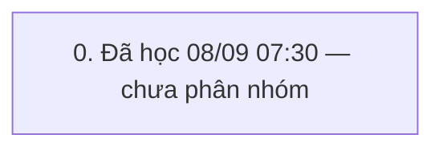

# QUY TRÌNH thêm khách và xóa (`THEM_KHACH`) — v3

> Trạng thái: **GĐ đã duyệt** · cập nhật 08/09/2026 14:59 · 1 pha · 8 bước (2 ghi) · KHBL làm 7 · cần kiểm 1 · bỏ 0

Nguồn học: HỌC từ đánh dấu seq 2340326→2341168 (08/09/2026 07:30, admin)

## 0. Đã học 08/09 07:30 — chưa phân nhóm

Bảng đổi trong khung: I_CUSTOMER, I_DIEMTICHLUY, I_LICHSUTICHLUYDIEM, SYS_BILL_COUNTER, SYS_CODEMASTERS, TRN_RT_BUYGOLD, T_TILL_BAL, T_TILL_TXN, T_TILL_TXN_DETAIL — ĐỐI CHIẾU 08/09: chỉ I_CUSTOMER +1 · I_DIEMTICHLUY +1 · SYS_CODEMASTERS CurValue(CU/09/26)+1 là của thao tác khách; SYS_BILL_COUNTER · TRN_RT_BUYGOLD · T_TILL_* · I_LICHSUTICHLUYDIEM là NHIỄU do máy khác đang bán/thâu trong khung đo, không thuộc quy trình.

| # | Bước | Proc | Ghi/đọc | Tham số quan trọng | Bảng đổi | KHBL | Đối chiếu | Ghi chú |
|---|---|---|---|---|---|---|---|---|
| 0.1 | Khách hàng: I_CUSTOMER_Lst | `I_CUSTOMER_Lst` | đọc | exec [I_CUSTOMER_Lst] @p_CustID='',@p_CustCode=N'',@p_CustName=N'',@p_Address=N'',@p_Phone='',@p_Notes=N'',@p_Active='',@p_Sort='CustName ASC',@p_CustGroupID='',@p_CustTypeID='',@p_BirthDate='',@p_Gender='',@p_Email='',@p_DateOfJoining='',@p_LastTradingDate='',@p_LoaiGD='',@ShopID='' | — | KHBL thực hiện | Chưa đối chiếu | — |
| 0.2 | Hệ thống: SYS_LOADCOMBO ×2 | `SYS_LOADCOMBO` ×N | đọc | exec [SYS_LOADCOMBO] @pType=N'I_CUSTOMER_GROUP',@pParam=N'',@ShopID='' | — | KHBL thực hiện | Chưa đối chiếu | — |
| 0.3 | Khác: I_GIAODICH_Lst | `I_GIAODICH_Lst` | đọc | I_GIAODICH_Lst | — | KHBL thực hiện | Chưa đối chiếu | — |
| 0.4 | Khách hàng: I_CUSTOMER_Ins | `I_CUSTOMER_Ins` | ghi | declare @p18 xml set @p18=convert(xml,N'') exec [I_CUSTOMER_Ins] @p_CustID='',@p_CustCode=N'',@p_CustName=N'Chị Njglsop',@p_Address=N'',@p_Phone='0236587491',@p_Notes=N'',@p_Active='1',@p_CMND='',@p_CustGroupID='',@p_CustTypeID='',@p_BirthDate='08/09/2026',@p_Gender='0',@p_Email='',@p_DateOfJoining='',@p_LastTradingDate='',@TuDongNangHang='1',@p_Image=NULL,@MaGD=@p18,@p_Company=N'',@p_Company_Addr | — | KHBL thực hiện | Khớp app | 08/09/2026 14:56 kiểm SANDBOX qua đúng view web /banle/khach-hang/luu/ (ép đích sandbox, không đụng KK): KHBL gọi Ins → đọc lại → I_DiemTichLuy_InsFromGT đúng thứ tự app; CustCode kế tiếp (KH55286→KH55287), sổ điểm mở, gửi lặp cùng token không tạo dòng trùng, trùng SĐT bị chặn. KHÁC app (cố ý): BirthDate gửi 01/01/1900 (app gửi = hôm nay), ImagePath NULL khi không có ảnh. ⚠ Proc vendor sinh CustCode bằng SELECT không MAX/ORDER — KK đang có 1.118 CustCode trùng (KH49124 ×3…), CustID mới là khóa thật. |
| 0.5 | Khách hàng: I_DiemTichLuy_InsFromGT | `I_DiemTichLuy_InsFromGT` | đọc | exec [I_DiemTichLuy_InsFromGT] @p_CustID='CU2609000000347' | — | KHBL thực hiện | Chưa đối chiếu | — |
| 0.6 | Khách hàng: I_CUSTOMER_Lst | `I_CUSTOMER_Lst` | đọc | exec [I_CUSTOMER_Lst] @p_CustID='',@p_CustCode=N'',@p_CustName=N'',@p_Address=N'',@p_Phone='',@p_Notes=N'',@p_Active='',@p_Sort='CustName ASC',@p_CustGroupID='',@p_CustTypeID='',@p_BirthDate='',@p_Gender='',@p_Email='',@p_DateOfJoining='',@p_LastTradingDate='',@p_LoaiGD='',@ShopID='' | — | KHBL thực hiện | Chưa đối chiếu | — |
| 0.7 | Khách hàng: I_CUSTOMER_Del | `I_CUSTOMER_Del` | ghi | exec [I_CUSTOMER_Del] @p_CustID='CU1807000000001' | — | Cần kiểm trên sandbox | Khớp app | 08/09/2026 kiểm SANDBOX: I_CUSTOMER_Del xóa I_DIEMTICHLUY + I_GIAODICH_KHACHHANG + SHOP_CUSTOMER + I_CUSTOMER, mọi bảng về số dòng ban đầu, counter SYS_CODEMASTERS KHÔNG lùi (mã CU cách quãng là bình thường); khách có TRN_RT_BUYSELL/DEBT/CHANGE/PO → Result=-1 từ chối. ⚠ fn_CheckValidate KHÔNG kiểm TRN_RT_BUYGOLD → khách CHỈ có hóa đơn THÂU vẫn xóa được (sandbox: 2.346 khách như vậy) → HĐ thâu mồ côi. ⚠ Proc luôn gọi XoaAnhKhachHang→SaveImageToFile (sp_OACreate): KK bật OLE nên chạy, ghi đè ảnh khách bằng PNG 1×1 chứ không xóa file; sandbox tắt OLE nên nổ (đã kiểm bằng cách tạm LuuAnhBangDuongDan=0). KHBL CHƯA có nút xóa khách; I_CUSTOMER_Del chưa vào PROC_WRITE_ALLOW. ⚠ Lần đo 07:29 trên KK: app xóa CU1807000000001 (KH0002 'A', tạo 20/07/2018) chứ KHÔNG phải khách vừa tạo — dòng đầu lưới sort CustName ASC; 2 khách thử KH55434 'Anh Abcdef' + KH55435 'Chị Njglsop' vẫn còn trên KK. |
| 0.8 | Khách hàng: I_CUSTOMER_Lst | `I_CUSTOMER_Lst` | đọc | exec [I_CUSTOMER_Lst] @p_CustID='',@p_CustCode=N'',@p_CustName=N'',@p_Address=N'',@p_Phone='',@p_Notes=N'',@p_Active='',@p_Sort='CustName ASC',@p_CustGroupID='',@p_CustTypeID='',@p_BirthDate='',@p_Gender='',@p_Email='',@p_DateOfJoining='',@p_LastTradingDate='',@p_LoaiGD='',@ShopID='' | — | KHBL thực hiện | Chưa đối chiếu | — |

