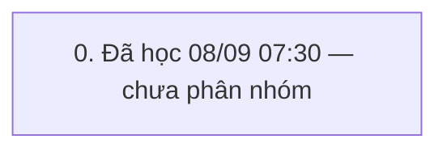

# QUY TRÌNH thêm khách và xóa (`THEM_KHACH`) — v2

> Trạng thái: **GĐ đã duyệt** · cập nhật 08/09/2026 07:30 · 1 pha · 8 bước (2 ghi) · KHBL làm 6 · cần kiểm 2 · bỏ 0

Nguồn học: HỌC từ đánh dấu seq 2340326→2341168 (08/09/2026 07:30, admin)

## 0. Đã học 08/09 07:30 — chưa phân nhóm

Bảng đổi trong khung: I_CUSTOMER, I_DIEMTICHLUY, I_LICHSUTICHLUYDIEM, SYS_BILL_COUNTER, SYS_CODEMASTERS, TRN_RT_BUYGOLD, T_TILL_BAL, T_TILL_TXN, T_TILL_TXN_DETAIL

| # | Bước | Proc | Ghi/đọc | Tham số quan trọng | Bảng đổi | KHBL | Đối chiếu | Ghi chú |
|---|---|---|---|---|---|---|---|---|
| 0.1 | Khách hàng: I_CUSTOMER_Lst | `I_CUSTOMER_Lst` | đọc | exec [I_CUSTOMER_Lst] @p_CustID='',@p_CustCode=N'',@p_CustName=N'',@p_Address=N'',@p_Phone='',@p_Notes=N'',@p_Active='',@p_Sort='CustName ASC',@p_CustGroupID='',@p_CustTypeID='',@p_BirthDate='',@p_Gender='',@p_Email='',@p_DateOfJoining='',@p_LastTradingDate='',@p_LoaiGD='',@ShopID='' | — | KHBL thực hiện | Chưa đối chiếu | — |
| 0.2 | Hệ thống: SYS_LOADCOMBO ×2 | `SYS_LOADCOMBO` ×N | đọc | exec [SYS_LOADCOMBO] @pType=N'I_CUSTOMER_GROUP',@pParam=N'',@ShopID='' | — | KHBL thực hiện | Chưa đối chiếu | — |
| 0.3 | Khác: I_GIAODICH_Lst | `I_GIAODICH_Lst` | đọc | I_GIAODICH_Lst | — | KHBL thực hiện | Chưa đối chiếu | — |
| 0.4 | Khách hàng: I_CUSTOMER_Ins | `I_CUSTOMER_Ins` | ghi | declare @p18 xml set @p18=convert(xml,N'') exec [I_CUSTOMER_Ins] @p_CustID='',@p_CustCode=N'',@p_CustName=N'Chị Njglsop',@p_Address=N'',@p_Phone='0236587491',@p_Notes=N'',@p_Active='1',@p_CMND='',@p_CustGroupID='',@p_CustTypeID='',@p_BirthDate='08/09/2026',@p_Gender='0',@p_Email='',@p_DateOfJoining='',@p_LastTradingDate='',@TuDongNangHang='1',@p_Image=NULL,@MaGD=@p18,@p_Company=N'',@p_Company_Addr | — | Cần kiểm trên sandbox | Chưa đối chiếu | — |
| 0.5 | Khách hàng: I_DiemTichLuy_InsFromGT | `I_DiemTichLuy_InsFromGT` | đọc | exec [I_DiemTichLuy_InsFromGT] @p_CustID='CU2609000000347' | — | KHBL thực hiện | Chưa đối chiếu | — |
| 0.6 | Khách hàng: I_CUSTOMER_Lst | `I_CUSTOMER_Lst` | đọc | exec [I_CUSTOMER_Lst] @p_CustID='',@p_CustCode=N'',@p_CustName=N'',@p_Address=N'',@p_Phone='',@p_Notes=N'',@p_Active='',@p_Sort='CustName ASC',@p_CustGroupID='',@p_CustTypeID='',@p_BirthDate='',@p_Gender='',@p_Email='',@p_DateOfJoining='',@p_LastTradingDate='',@p_LoaiGD='',@ShopID='' | — | KHBL thực hiện | Chưa đối chiếu | — |
| 0.7 | Khách hàng: I_CUSTOMER_Del | `I_CUSTOMER_Del` | ghi | exec [I_CUSTOMER_Del] @p_CustID='CU1807000000001' | — | Cần kiểm trên sandbox | Chưa đối chiếu | — |
| 0.8 | Khách hàng: I_CUSTOMER_Lst | `I_CUSTOMER_Lst` | đọc | exec [I_CUSTOMER_Lst] @p_CustID='',@p_CustCode=N'',@p_CustName=N'',@p_Address=N'',@p_Phone='',@p_Notes=N'',@p_Active='',@p_Sort='CustName ASC',@p_CustGroupID='',@p_CustTypeID='',@p_BirthDate='',@p_Gender='',@p_Email='',@p_DateOfJoining='',@p_LastTradingDate='',@p_LoaiGD='',@ShopID='' | — | KHBL thực hiện | Chưa đối chiếu | — |

